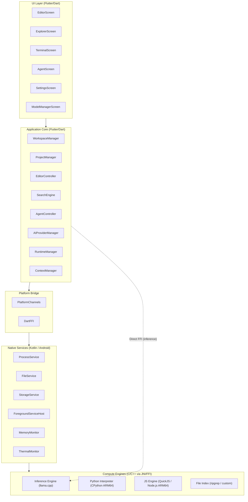
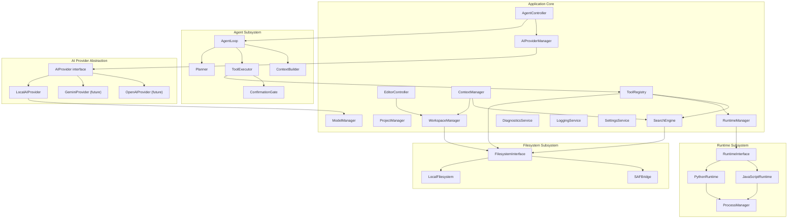
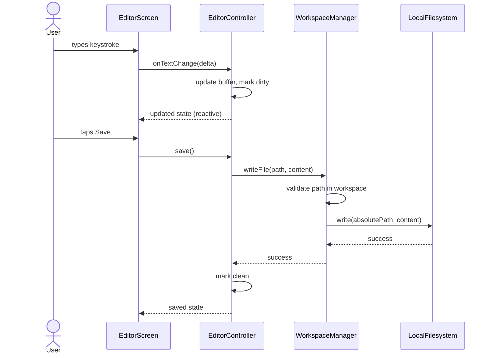
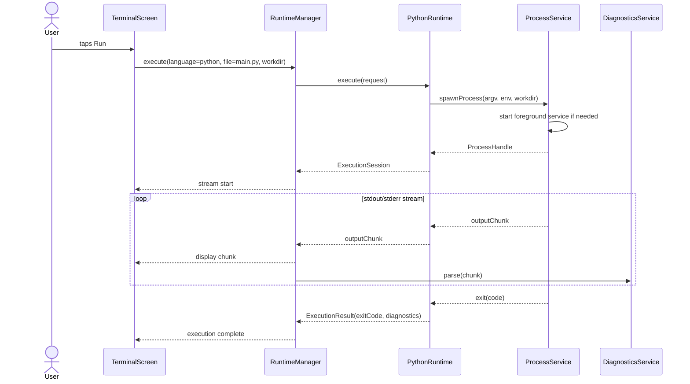
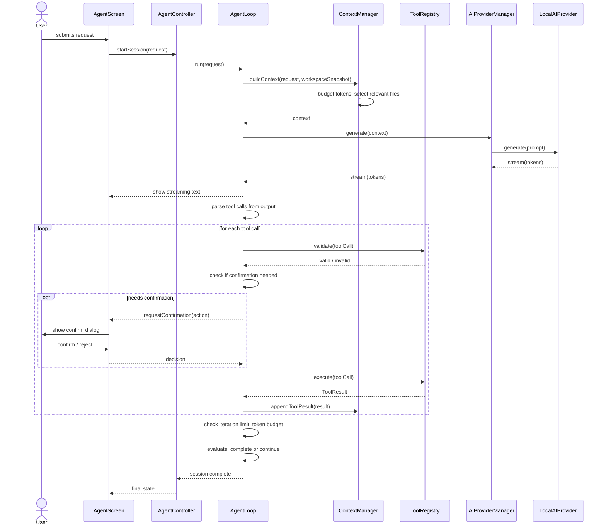
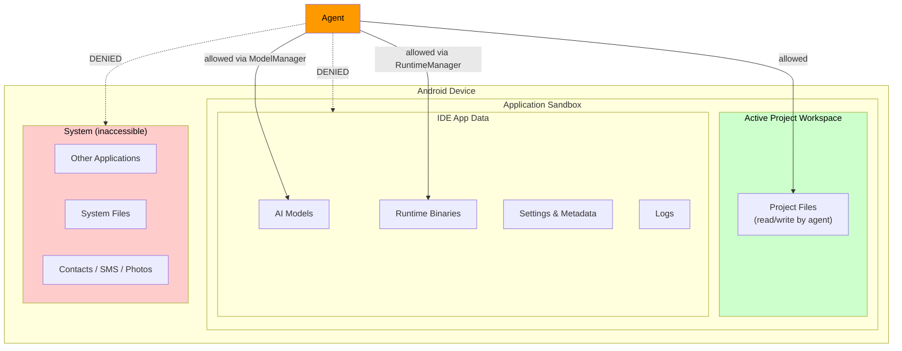

# 02 — Architecture

**Project:** Mylonite IDE  
**Version:** 0.1 (Architecture Phase)  
**Status:** Pre-implementation  
**Last Updated:** 2026-08-30

---

## Table of Contents

1. [System Overview](#1-system-overview)
2. [Layer Architecture](#2-layer-architecture)
3. [Component Architecture](#3-component-architecture)
4. [Platform Layer and Android Specifics](#4-platform-layer-and-android-specifics)
5. [Technology Division](#5-technology-division)
6. [Data Flow](#6-data-flow)
7. [AI and Agent Flow](#7-ai-and-agent-flow)
8. [Runtime Execution Flow](#8-runtime-execution-flow)
9. [Filesystem Flow](#9-filesystem-flow)
10. [Security Boundaries](#10-security-boundaries)
11. [Communication Mechanisms](#11-communication-mechanisms)
12. [Lifecycle Management](#12-lifecycle-management)
13. [Failure Handling](#13-failure-handling)
14. [Resource Management](#14-resource-management)
15. [Extensibility](#15-extensibility)
16. [Architectural Decision Records](#16-architectural-decision-records)
17. [Open Questions and Investigations Required](#17-open-questions-and-investigations-required)

---

## 1. System Overview

The Offline Mobile IDE is a self-contained Android application. It has no mandatory server-side components and no cloud dependencies for its core operation. All compute — code editing, code execution, AI inference, file indexing — happens on the device.

The system is composed of five primary concerns:

1. **UI Layer** — Flutter-based mobile-native interface
2. **Application Core** — Dart/Flutter business logic, orchestration, and service coordination
3. **Platform Bridge** — The boundary between Flutter/Dart and Android/native code
4. **Native Services** — Android Kotlin services, JNI-exposed C/C++ libraries
5. **Engines** — The actual compute: runtime interpreters, AI inference engine, file index



---

## 2. Layer Architecture

### 2.1 Layer Definitions

| Layer | Technology | Responsibility |
|---|---|---|
| **UI Layer** | Flutter / Dart | All user-facing screens and widgets. No business logic. |
| **Application Core** | Flutter / Dart | Business logic, state management, orchestration. Calls platform bridge and native services. |
| **Platform Bridge** | Platform Channels + Dart FFI | Translates between Dart and Android/native. Handles serialization. |
| **Native Services** | Kotlin / Android SDK | Android-specific functionality: process spawning, foreground services, Android storage, memory/thermal APIs. |
| **Compute Engines** | C/C++ / prebuilt binaries | Actual heavy computation: AI inference, runtime interpreters, file indexing. |

### 2.2 Strict Layer Separation Rules

- The UI layer calls the Application Core only. It never calls native code directly.
- The Application Core calls the Platform Bridge only. It does not call Android APIs directly.
- The Platform Bridge dispatches to Kotlin services or native C/C++ libraries.
- The Compute Engines do not call back into Dart except through defined callback/stream mechanisms.
- This separation means the UI and Core layers are theoretically portable to other platforms (iOS, desktop) if the Platform Bridge is reimplemented.

### 2.3 Layer Communication Pattern

```
UI Screen
  ↓ (calls)
Core Controller / Manager
  ↓ (calls via interface)
Platform Bridge (Platform Channel or FFI)
  ↓ (dispatches to)
Android Native Service / C++ Library
  ↓ (results returned via)
Futures / Streams / Callbacks
  ↑ (propagated back up the stack)
UI updates via state management
```

---

## 3. Component Architecture

### 3.1 Full Component Map



### 3.2 Core Managers — Responsibilities

#### WorkspaceManager
- Owns the currently active project workspace path
- Provides file read/write/create/delete/list operations scoped to the workspace
- Enforces that no path traversal escapes the workspace root
- Publishes workspace change events

#### ProjectManager
- Manages the list of known projects (stored as metadata)
- Handles project creation, opening, closing, deletion
- Reads and writes project metadata files
- Does not manage file content — delegates to WorkspaceManager

#### EditorController
- Manages the open file buffer(s)
- Tracks dirty state, undo/redo stacks
- Applies AI-proposed diffs
- Saves to WorkspaceManager
- Publishes cursor position, selection, and diagnostics state

#### SearchEngine
- Provides filename search over the project tree
- Provides text/regex search over file contents
- Results include file path, line number, and match context
- Delegates actual file reading to WorkspaceManager
- Future: symbol search via language-aware indexer

#### AgentController
- Entry point for user-initiated agent sessions
- Manages the AgentLoop lifecycle
- Provides the user-facing session state (IDLE, RUNNING, WAITING_CONFIRMATION, STOPPED, COMPLETE, ERROR)
- Routes responses back to the UI

#### AIProviderManager
- Holds the registered AIProvider implementations
- Selects the active provider based on user settings
- Exposes a unified interface for text generation and streaming
- Does not understand agent logic — it only generates text

#### RuntimeManager
- Holds registered RuntimeInterface implementations
- Routes execution requests to the correct runtime by language
- Aggregates process output streams
- Manages runtime lifecycle (start, stop, version check)

#### ContextManager
- Builds the LLM context window for agent and assistant interactions
- Applies token budget constraints
- Selects relevant files via search and heuristics
- Tracks conversation and tool history
- Handles context compression when approaching limits

#### ToolRegistry
- Maintains the allowlist of agent-callable tools
- Validates tool call schemas before execution
- Routes tool calls to the appropriate subsystem
- Returns structured ToolResult objects

#### ModelManager
- Manages locally installed AI model files
- Stores model metadata (name, size, quantization, context length, format)
- Handles model activation/deactivation
- Checks device RAM compatibility before loading
- Communicates with LocalAIProvider for load/unload

#### DiagnosticsService
- Collects errors and warnings from runtime execution output
- Parses error messages from Python and JavaScript runtimes
- Produces structured Diagnostic objects with file path and line number where parseable
- Supplies diagnostics to EditorController for inline display

#### LoggingService
- Structured logging with subsystem tags (UI, CORE, FS, RUNTIME, AGENT, AI, SECURITY, PROCESS)
- Level-based filtering: VERBOSE, DEBUG, INFO, WARN, ERROR
- In-memory ring buffer (last N entries) for debugging
- Persistent log written only in DEBUG mode
- No user code, conversation content, or credentials in INFO level or above

#### SettingsService
- Reads and writes application settings
- Global settings: editor preferences, AI provider, selected model, network mode, UI theme
- Per-project settings overrides where applicable
- Persisted to app-internal storage as structured data

---

## 4. Platform Layer and Android Specifics

This section answers the critical Android-specific architectural questions from the PRD.

### 4.1 Process Execution on Android

**Question:** How can arbitrary local processes realistically be executed?

Android applications can spawn child processes using `ProcessBuilder` (Java/Kotlin) or `posix_spawn` / `exec` family calls (C/C++ via JNI). The key constraints are:

- The executable binary must exist in a directory not mounted with the `noexec` flag. Android's `/data/data/<package>/files/` directory is mounted `noexec` on most devices. The directory that permits execution of extracted native libraries is `getApplicationInfo().nativeLibraryDir` (typically `/data/app/<package>/lib/arm64/`), which is `exec`-able.
- Alternatively, some devices permit execution from the app's own `files/` directory if it is on a partition without `noexec`. **This is device-dependent and cannot be assumed universally.**
- The most reliable strategy: ship runtime executables as native `.so` files (which Android installs to `nativeLibraryDir`), then symlink or invoke them from there. This is the approach used by Termux and similar applications.
- Working directory can be set via `ProcessBuilder.directory()`.
- Environment variables are set via `ProcessBuilder.environment()`.
- stdin/stdout/stderr are piped via `Process.getInputStream()` / `getOutputStream()` / `getErrorStream()`.

**Feasibility:** Confirmed for Python and Node.js via the `.so` naming trick. Used in production by Termux.

**Restrictions:**
- No access to system binaries (`/usr/bin`, `/bin`) unless they are shipped in the APK
- No system-wide PATH modification
- Child processes inherit the parent process's sandbox, so they have the same file system access restrictions

### 4.2 Long-Running Processes

Long-running processes (AI inference, code execution, file indexing) must be managed through Android **Foreground Services**.

A Foreground Service:
- Keeps the process alive even when the app is not in the foreground
- Requires a visible notification in the system tray
- Is explicitly killed only when the user or system demands it (not subject to standard background process limits)
- Must be started with `startForeground()` within 5 seconds of service start (Android 8+)

The `ForegroundServiceHost` Kotlin component will host all long-running operations:
- AI inference session
- Code execution process
- Background file indexing

For short executions (< 5 seconds), foreground services are not required. The `ProcessService` handles these inline.

### 4.3 Runtime Bundling Strategy

Runtimes (Python, Node.js) must be bundled as precompiled ARM64 binaries. The options are:

| Approach | Mechanism | Pros | Cons |
|---|---|---|---|
| **Ship as `.so` in APK** | Named `libpython.so`, etc. — installed to `nativeLibraryDir` | Always executable; reliable | APK size grows; all versions bundled at install |
| **Download on first use** | Fetch from CDN; store in app files; mark executable | Small initial APK; user controls version | Requires internet for first use; `noexec` risk |
| **Hybrid: stub + download** | Small stub in APK; full runtime downloaded on setup | Balanced APK size; graceful degradation | More complex; download still needed |

**Decision:** Hybrid approach. A minimal application skeleton ships in the APK. Runtimes are downloaded and installed to the application's internal storage on first use (or on demand via the Runtime Manager screen). This is consistent with the offline-first principle once installed, while keeping the APK size manageable.

**Critical note on `noexec`:** The application must detect whether its internal storage path supports execution at runtime and handle the failure gracefully. The Termux project's solution — using `nativeLibraryDir` — is the most robust approach for the initial interpreter binary. Supporting libraries can then live in `files/`.

### 4.4 Native Library Role (Kotlin / JNI)

The division of responsibility between Dart, Kotlin, and C/C++ is as follows:

```
Dart/Flutter:
  - All UI rendering
  - All business logic and orchestration
  - State management
  - LLM prompt construction and tool call parsing
  - Conversation management

Kotlin/Android:
  - Process spawning (ProcessBuilder)
  - Foreground service lifecycle
  - Android Storage Access Framework (SAF) integration
  - Memory monitoring (ActivityManager.MemoryInfo)
  - Thermal status monitoring (PowerManager.ThermalStatus)
  - Android-specific permissions handling
  - Wake lock management during inference

C/C++ (via JNI from Kotlin, or Dart FFI directly):
  - AI inference (llama.cpp)
  - File indexing (optional native indexer)
  - Performance-critical string/regex processing
```

**FFI vs Platform Channels — Decision:**
- For the **inference engine (llama.cpp):** Use **Dart FFI** directly. llama.cpp exposes a C API. Calling it directly from Dart via FFI is more efficient than routing through Kotlin/JNI (avoids double serialization), and Flutter's Dart FFI is production-ready for this use case. See ADR-004.
- For **Android system services** (process spawning, SAF, memory, thermal): Use **Platform Channels** (Flutter's standard MethodChannel/EventChannel). These operations are inherently Kotlin/Java — they call Android SDK APIs that have no C equivalent.
- For **runtime process management:** Use Platform Channels into a Kotlin `ProcessService`.

### 4.5 Android Storage

```
App Internal Storage:
  /data/data/<package>/files/
    └── projects/           ← User project workspaces
    └── runtimes/           ← Installed runtime binaries
    └── models/             ← AI model files (.gguf)
    └── index/              ← File search indexes
    └── ide_metadata/       ← Project metadata, settings, logs

App External Storage (if available, not guaranteed):
  Android/data/<package>/files/
    └── (overflow for large models if internal storage insufficient)

User-selected storage (SAF):
  ← User can grant access to arbitrary directories via SAF
  ← Used for project import/export only
```

**Scoped Storage compliance:** The application will not attempt to access any path outside `getFilesDir()` or `getExternalFilesDir()` without going through the SAF picker. This ensures Android 10+ compatibility without the `MANAGE_EXTERNAL_STORAGE` permission, which requires Play Store justification and grants broad access.

### 4.6 Background Execution and Battery

The application interacts with three Android battery management systems:

| System | API | Response |
|---|---|---|
| Doze Mode | `PowerManager.isDeviceIdleMode()` | Foreground service exempts from doze |
| App Standby | Automatic | Foreground service and user-initiated actions exempted |
| Battery Saver | `PowerManager.isPowerSaveMode()` | Reduce inference batch size; warn user |
| Thermal Throttling | `PowerManager.ThermalStatus` (API 29+) | Reduce inference threads; pause non-critical background tasks |

---

## 5. Technology Division

### 5.1 Decision Summary

| Subsystem | Primary Technology | Reason |
|---|---|---|
| UI / Screens | Flutter (Dart) | Cross-platform UI framework; mobile-first; single codebase |
| Business Logic | Flutter (Dart) | Collocated with UI for state; fast iteration |
| AI Inference | C/C++ (llama.cpp) via Dart FFI | Only mature on-device inference engine with ARM64 NEON support |
| Python Runtime | CPython prebuilt ARM64 binary | Only full-featured Python implementation; proven by Termux |
| JavaScript Runtime | QuickJS (primary) / Node.js ARM64 (future) | QuickJS is small, embeddable, ARM64-clean; Node.js for npm compat |
| Process Management | Kotlin (Android) | ProcessBuilder is a Java/Android API; needs foreground service lifecycle |
| File Search | Dart (primary) / native Rust binary (future) | Dart sufficient for V1 file counts; ripgrep-style indexer for scale |
| Storage | App-internal files + Android SharedPreferences | No separate database for V1; structured JSON for metadata |
| Settings | Flutter (SharedPreferences / encrypted) | Standard Flutter approach |
| Secrets (API keys) | EncryptedSharedPreferences (Kotlin) | Android Keystore-backed encryption |

### 5.2 Flutter vs Native Android — ADR Summary

See ADR-001 in Section 16.

### 5.3 QuickJS vs Node.js

| Criterion | QuickJS | Node.js ARM64 |
|---|---|---|
| Binary size | ~200 KB | ~40–80 MB |
| V1 feasibility | Confirmed | Requires Investigation |
| npm compatibility | No | Yes |
| ES2020 compliance | Yes | Yes |
| Embedded in app | Yes (as shared lib) | No (separate process) |
| V8 performance | Lower (bytecode interp.) | Higher (JIT) |
| Use case | Scripting, agent tools | Full Node.js projects |

**Decision for V1:** QuickJS as the JavaScript execution engine. Node.js ARM64 is a future investigation for when npm support is required. QuickJS can be compiled as a native shared library and invoked either as a subprocess or via JNI/FFI. This keeps the JavaScript runtime lightweight and avoids the large storage footprint of Node.js.

---

## 6. Data Flow

### 6.1 User Edits a File



### 6.2 User Runs Code



### 6.3 Settings and Initialization

On application startup:
1. `SettingsService` loads global settings from storage
2. `ModelManager` reads installed model metadata
3. `RuntimeManager` checks installed runtime versions
4. `ProjectManager` reads the last-opened project (if any) and restores workspace
5. AI model is **not** loaded eagerly — it loads on first use or explicit activation

---

## 7. AI and Agent Flow

### 7.1 User Sends a Message to the Agent



### 7.2 Agent State Machine

```
         ┌──────────────────────────────┐
         │             IDLE             │
         └──────────────┬───────────────┘
                        │ user submits request
                        ▼
         ┌──────────────────────────────┐
         │           ANALYZING          │
         └──────────────┬───────────────┘
                        │
                        ▼
         ┌──────────────────────────────┐
         │           PLANNING           │◄─────────────────┐
         └──────────────┬───────────────┘                  │
                        │                                   │
                        ▼                                   │
         ┌──────────────────────────────┐                  │
         │           ACTING             │                   │
         │  (tool calls / generation)   │                   │
         └──────────────┬───────────────┘                  │
                        │                                   │
                        ▼                                   │
         ┌──────────────────────────────┐                  │
         │      WAITING_CONFIRMATION    │                   │
         │   (if dangerous operation)   │                   │
         └──────────────┬───────────────┘                  │
                        │ user confirms                     │
                        ▼                                   │
         ┌──────────────────────────────┐                  │
         │          OBSERVING           │                   │
         │   (reading tool results)     │                   │
         └──────────────┬───────────────┘                  │
                        │                                   │
                        ▼                                   │
         ┌──────────────────────────────┐                  │
         │          EVALUATING          │                   │
         └──────┬───────────────────────┘                  │
                │                                           │
        ┌───────┴──────────┐                               │
        │ not complete      │ complete                      │
        ▼                  ▼                                │
  ┌──────────┐    ┌──────────────────┐                     │
  │  FIXING  │    │    VALIDATING    │                     │
  └─────┬────┘    └────────┬─────────┘                     │
        │                  │                                │
        │ iteration < max  │ success                       │
        └──────────────────┼───────────────────────────────┘
                           ▼
                  ┌─────────────────┐
                  │    COMPLETE     │
                  └─────────────────┘
                  
   At any state: user cancels → CANCELLED
   Iteration limit reached → ERROR(limit_exceeded)
   Token budget exceeded → ERROR(budget_exceeded)
   Tool failure N times → ERROR(tool_failure)
```

---

## 8. Runtime Execution Flow

### 8.1 Python Execution

```
User triggers Run
        │
        ▼
RuntimeManager.execute(language="python", entrypoint="main.py")
        │
        ▼
PythonRuntime.execute(request)
        │
        ├── resolve Python binary path (nativeLibraryDir or runtimes/)
        ├── set up environment variables (PYTHONPATH, PYTHONHOME, etc.)
        ├── set working directory = project root
        ├── construct argv: [python3, main.py, ...args]
        │
        ▼
ProcessService.spawnProcess(argv, env, workdir)
        │
        ├── Kotlin: ProcessBuilder(argv).directory(workdir).start()
        ├── attach stdin/stdout/stderr pipes
        ├── start foreground service if execution expected > threshold
        │
        ▼
ExecutionSession (stream handle)
        │
        ├── stdout → TerminalScreen + DiagnosticsService
        ├── stderr → TerminalScreen + DiagnosticsService
        ├── exit code → ExecutionResult
        │
        ▼
DiagnosticsService.parse(output)
        │
        ├── extract Python tracebacks
        ├── extract file/line references
        ├── produce Diagnostic[]
        │
        ▼
EditorController.applyDiagnostics(diagnostics)
```

### 8.2 Process Cancellation

```
User taps Stop
        │
        ▼
RuntimeManager.cancel(sessionId)
        │
        ▼
ProcessService.terminate(pid)
        │
        ├── SIGTERM to child process
        ├── wait 2 seconds
        ├── SIGKILL if still running
        │
        ▼
ExecutionSession closes
        │
        ▼
Foreground service stops (if started)
```

---

## 9. Filesystem Flow

### 9.1 Path Safety Model

All file operations in the Application Core go through `WorkspaceManager`. It enforces:

```
WorkspaceManager.validatePath(path):
    absolutePath = resolve(workspaceRoot, path)
    if not absolutePath.startsWith(workspaceRoot):
        throw SecurityException("Path traversal denied")
    return absolutePath
```

This prevents path traversal attacks and accidental access to files outside the project workspace. It applies to both user-initiated operations and agent tool calls.

### 9.2 SAF Integration

Android's Storage Access Framework is used for:
- ZIP project import (user opens a file picker → SAF returns a URI → app reads via ContentResolver)
- ZIP project export (user opens a directory picker → SAF returns a URI → app writes via ContentResolver)
- One-time file inclusion into a project from external storage

SAF URIs are **not** stored as persistent workspace paths. All workspace operations use internal file paths. SAF content is always copied into the workspace.

### 9.3 File Watching

Android does not provide a reliable cross-version inotify-style file watcher for app storage. File change events (for auto-reload, diagnostic refresh) will be handled by:
- **Explicit save events** from EditorController (primary mechanism)
- **Polling** on a configurable interval for external file changes (low frequency, power-efficient)

---

## 10. Security Boundaries



### 10.1 Trust Levels

| Entity | Trust Level | Reasoning |
|---|---|---|
| User (direct UI interaction) | High | Explicit user actions; confirmation gates protect destructive ops |
| AI Agent | Medium | Autonomous but sandboxed; needs confirmation for destructive actions |
| Project file content | Untrusted | Could contain prompt injection; treated as data, never instructions |
| Runtime process | Sandboxed | Child process inherits app sandbox; cannot escape to system |
| Cloud AI provider | Low | Never receives code unless user opts in and provider is configured |
| AI model weights | Trusted once verified | Loaded from app-internal storage; not modified by agent |

### 10.2 Threat Boundaries

See `06-SECURITY.md` for the full threat model. Architecture-level security properties:

1. The `WorkspaceManager` is the sole enforcer of path confinement. No code bypasses it.
2. The `ToolRegistry` is the sole entry point for agent-initiated actions. No agent output is executed directly.
3. The `ConfirmationGate` intercepts all destructive tool calls before execution.
4. The `AIProviderManager` never forwards API keys to the Application Core layer — keys are fetched in Kotlin and injected into HTTPS headers only.

---

## 11. Communication Mechanisms

### 11.1 Flutter Platform Channels

Used for: Process management, Android system APIs, SAF, storage, memory/thermal monitoring.

| Channel Name | Type | Direction | Purpose |
|---|---|---|---|
| `ide/process` | MethodChannel | Dart → Kotlin | Spawn/kill processes |
| `ide/process/output` | EventChannel | Kotlin → Dart | Stream stdout/stderr |
| `ide/storage` | MethodChannel | Dart → Kotlin | SAF file operations |
| `ide/system` | MethodChannel | Dart → Kotlin | Memory, thermal, battery queries |
| `ide/secrets` | MethodChannel | Dart → Kotlin | Read encrypted credentials |

### 11.2 Dart FFI

Used for: Direct AI inference calls to llama.cpp C API.

The llama.cpp library exposes a C API (`llama_init`, `llama_eval`, `llama_sample_token`, etc.). Dart FFI can bind to a `.so` compiled from llama.cpp. This avoids the Platform Channel overhead for the high-frequency token generation loop.

The FFI binding layer will be a thin Dart wrapper. It will:
- Expose `Future<void> loadModel(path)` and `void unloadModel()`
- Expose a `Stream<String> generate(prompt, params)` interface
- Handle cancellation via an isolate and native callback

### 11.3 Internal Dart Communication

Within the Flutter/Dart layer, communication uses:
- **Riverpod / Provider** (or equivalent state management) for reactive UI updates
- **Dart Streams** for asynchronous event flows (agent output, process output)
- **Futures** for one-shot async operations (file reads, saves)

The specific state management library will be decided in Phase 1. The architecture does not mandate a specific solution — any reactive state management package that supports streams is compatible.

---

## 12. Lifecycle Management

### 12.1 Android Lifecycle Events

| Event | Application Response |
|---|---|
| `onPause` | Flush editor buffer to temp file; reduce polling frequency |
| `onStop` | If agent is running: continue via foreground service; else suspend |
| `onDestroy` | Terminate all running processes; save all dirty files; unload model if memory pressure |
| `onTrimMemory(CRITICAL)` | Unload AI model immediately; stop background indexing |
| `onTrimMemory(MODERATE)` | Flush caches; reduce KV cache allocation |

### 12.2 Model Loading Lifecycle

```
User requests AI interaction
        │
        ▼
ModelManager.ensureLoaded(modelId)
        │
        ├── if already loaded: return
        ├── check available RAM > model.estimatedRam + buffer(500MB)
        │   ├── if insufficient: error "Not enough RAM" → user can close apps
        │   └── if sufficient: proceed
        │
        ▼
LocalAIProvider.loadModel(path)
        │
        ├── FFI: llama_init(model_path, n_ctx, n_threads)
        ├── blocks Dart isolate until loaded
        │
        ▼
Model ready → generation can begin

On onTrimMemory(CRITICAL) or user explicit unload:
        │
        ▼
LocalAIProvider.unloadModel()
        │
        ├── FFI: llama_free(ctx)
        ├── ModelManager.setStatus(UNLOADED)
```

### 12.3 Runtime Process Lifecycle

| State | Description |
|---|---|
| `AVAILABLE` | Runtime binary exists and is functional |
| `NOT_INSTALLED` | Runtime not yet downloaded/installed |
| `RUNNING` | A process is currently executing |
| `IDLE` | Installed but no process active |
| `ERROR` | Runtime binary failed health check |

---

## 13. Failure Handling

### 13.1 Failure Categories and Responses

| Failure | Layer | Response |
|---|---|---|
| Runtime not installed | RuntimeManager | Surface "install runtime" prompt; no crash |
| Process crash (non-zero exit) | ProcessService | Capture stderr; return to DiagnosticsService; display in terminal |
| Model not loaded / OOM | LocalAIProvider | Error to AgentController; surface RAM warning to user |
| Agent iteration limit reached | AgentLoop | Stop loop; return partial result + explanation to user |
| Agent tool call failed | ToolRegistry | Return ToolResult(error); agent can retry or escalate |
| Tool call schema invalid | ToolRegistry | Reject immediately; log; agent must reformulate |
| Malformed AI output (no valid tool call) | AgentLoop | Retry up to N times with clarification prompt; then stop |
| File write permission denied | WorkspaceManager | Propagate error to calling layer; display to user |
| Path traversal attempt | WorkspaceManager | Log security event; reject; surface error in agent output |
| SAF URI expired | SAFBridge | Request re-grant from user; do not crash |
| Network unavailable (cloud AI) | AIProviderManager | Fall back to local provider if configured; else error |
| Thermal throttle detected | ThermalMonitor | Notify AgentController; reduce inference thread count |
| Storage full | LocalFilesystem | Error on write; surface storage warning |

### 13.2 Error Propagation Pattern

All subsystems return typed result objects rather than throwing unhandled exceptions to the UI. The pattern is:

```
Result<T, AppError>
    ├── Success(value: T)
    └── Failure(error: AppError)

AppError
    ├── code: ErrorCode (enum)
    ├── message: String (user-visible, localized)
    ├── detail: String? (technical, log-only)
    └── subsystem: Subsystem (enum)
```

The UI layer maps `AppError` codes to appropriate user-facing messages and recovery suggestions.

---

## 14. Resource Management

### 14.1 RAM Budget Planning (Tier B device: 6 GB total)

| Component | Estimated RAM | Notes |
|---|---|---|
| Android OS + system | ~2.0–2.5 GB | Varies; baseline overhead |
| Flutter app (no model) | ~150–250 MB | UI, business logic, caches |
| Python runtime (idle) | ~30–80 MB | CPython baseline |
| File index (small project) | ~20–50 MB | In-memory index |
| **1B Q4 model** | ~700 MB–1 GB | Weights + KV cache |
| **3B Q4 model** | ~2.0–2.5 GB | Weights + KV cache |
| **Headroom** | ~500 MB | For Android allocations during inference |

On a 6 GB device, running the app + Python + 3B model simultaneously is tight but feasible with careful management. The app must:
- Not load the model until explicitly needed
- Offer to unload the model when running code (if user opts in)
- Monitor `ActivityManager.MemoryInfo.availMem` continuously

### 14.2 CPU Thread Budget

AI inference thread count must be configurable and should default conservatively:

| Device Tier | Default Inference Threads | Max |
|---|---|---|
| Tier A | 2 | 4 |
| Tier B | 4 | 6 |
| Tier C | 6 | 8 |

On thermal throttle signal, the application reduces active inference threads by 2 (minimum 1).

### 14.3 Battery Management

| Operation | Strategy |
|---|---|
| Continuous inference | Use foreground service; notify user of ongoing battery use |
| Background indexing | Defer to device-idle or charging state |
| Polling for file changes | 30-second interval when app is backgrounded |
| Model warm-standby | Unload model after N minutes of inactivity (configurable) |

### 14.4 Storage Budget Guidance

| Item | Approximate Size |
|---|---|
| App base (APK) | ~50–100 MB |
| Python 3.12 ARM64 (binary + stdlib) | ~60–100 MB |
| QuickJS ARM64 | ~1–5 MB |
| 1B Q4_K_M model | ~700 MB |
| 3B Q4_K_M model | ~1.9 GB |
| 7B Q4_K_M model | ~4.1 GB |
| Typical small project | ~1–50 MB |

The app should display a storage calculator before the user downloads runtimes or models.

---

## 15. Extensibility

### 15.1 Adding a New Runtime

To add a new language runtime (e.g., Ruby), a developer:
1. Creates a class implementing `RuntimeInterface`
2. Provides the prebuilt ARM64 binary (or download mechanism)
3. Registers the runtime with `RuntimeManager`
4. No changes to: Agent, Editor, Terminal, AI Provider, or any other subsystem

### 15.2 Adding a New AI Provider

To add a new AI provider (e.g., Anthropic Claude API):
1. Creates a class implementing `AIProvider`
2. Adds provider-specific configuration schema to `SettingsService`
3. Registers with `AIProviderManager`
4. No changes to: Agent loop, tool system, editor, runtimes, or any other subsystem

### 15.3 Replacing the Editor Component

The editor is accessed through `EditorController`. The underlying text editing widget is isolated. Replacing it (e.g., switching from a custom CodeMirror WebView to a native Flutter editor) requires only replacing the widget layer and its binding to `EditorController`. The rest of the system is unaffected.

### 15.4 Future Plugin Architecture

A future plugin system could expose the same interfaces (`RuntimeInterface`, `AIProvider`, `ToolDefinition`) as extension points. The architecture does not implement this in V1 but must not close the door on it — particularly by hardcoding runtime or provider lists in non-extensible data structures.

---

## 16. Architectural Decision Records

### ADR-001: Flutter as Primary UI Framework

**Decision:** Flutter is the primary UI framework.

**Context:** The team needs a mobile-first UI framework for Android with the option to extend to other platforms later. Options: Flutter, React Native, native Android (Kotlin/XML or Compose).

| Option | Pros | Cons |
|---|---|---|
| Flutter | Single codebase for potential cross-platform; strong widget library; good performance; active ecosystem | Dart FFI adds complexity; less mature than native for some Android APIs |
| React Native | Large ecosystem; JS familiarity | Bridge overhead; worse performance for complex UIs; less control over native threads |
| Native Android (Compose) | Best Android-specific performance; direct API access | Android-only; no cross-platform path |

**Decision:** Flutter. The cross-platform potential and active ecosystem outweigh the FFI complexity. Native Android code is still used for Android-specific functionality through Platform Channels.

**Consequences:** Dart is the primary application language. Performance-critical native code uses Dart FFI (inference) or Platform Channels (Android system APIs).

---

### ADR-002: llama.cpp as Inference Engine

**Decision:** llama.cpp is the primary inference engine for local AI.

**Context:** We need a local AI inference engine that runs on ARM64 Android without GPU or with optional GPU acceleration. Options: llama.cpp, MNN, NCNN, ExecuTorch, MediaPipe LLM.

See `05-OFFLINE-AI.md` for the full evaluation.

**Summary:** llama.cpp is the most mature, actively maintained, ARM64-optimized, GGUF-compatible inference engine available as of 2026. It has proven Android deployments (via apps like Ollama Android, LM Studio mobile prototypes, and multiple open-source projects).

**Consequences:** Model format is GGUF. Dart FFI binding to llama.cpp C API. Build system must compile llama.cpp for `arm64-v8a` with NEON intrinsics enabled.

---

### ADR-003: QuickJS as V1 JavaScript Engine

**Decision:** QuickJS is the V1 JavaScript execution engine. Node.js ARM64 is deferred to a future phase.

**Context:** JavaScript execution is required for V1. Node.js brings npm compatibility but is large (~40–80 MB binary) and its embeddability on Android requires investigation. QuickJS is tiny, fully embeddable, and ES2020 compliant.

**Consequences:** V1 JavaScript cannot use npm packages. This is acceptable for the MVP use case (scripting, simple programs). When npm support is required (FUT-003), Node.js ARM64 will be evaluated as a separate runtime alongside QuickJS.

---

### ADR-004: Dart FFI for Inference vs Platform Channels

**Decision:** Use Dart FFI directly for llama.cpp inference. Use Platform Channels for Android system services.

**Context:** Two options for calling native C code from Flutter: (1) Dart FFI — direct binding to C functions from Dart; (2) Platform Channels — Dart calls Kotlin, Kotlin calls JNI, JNI calls C. Option 2 is a double bridge and adds latency for the high-frequency token generation loop (potentially thousands of calls per inference).

**Decision:** FFI for inference; Platform Channels for Android SDK APIs that have no C equivalent (process management, SAF, memory monitoring, thermal API).

**Consequences:** Requires maintaining Dart FFI bindings for llama.cpp. The llama.cpp C API is relatively stable. The inference binding is isolated to the `LocalAIProvider` class.

---

### ADR-005: No Dedicated Database for V1

**Decision:** V1 uses structured JSON/binary files for metadata, not a relational or embedded database.

**Context:** The application needs to persist: project metadata, settings, model metadata, conversation history. Options: SQLite (via drift/sqflite), Hive (key-value), Isar, structured JSON files.

**Reasoning:** V1 data volumes are small (tens of projects, hundreds of conversations). A full database adds dependency weight, migration complexity, and schema management overhead. Structured JSON files in well-defined directories are sufficient and simpler.

**Exceptions:** If conversation history or agent sessions grow to the point where file-based querying is slow, SQLite (via the `sqflite` Flutter package) will be introduced for those specific collections only.

**Consequences:** No ORM. No migrations in V1. Schema changes are handled by version-tagged JSON files with a migration step on app upgrade.

---

## 17. Open Questions and Investigations Required

| # | Question | Feasibility | Required By |
|---|---|---|---|
| OQ-001 | Which specific Android devices/versions permit `exec()` from `getFilesDir()`? | Requires Investigation | Phase 4 |
| OQ-002 | Can CPython be reliably invoked from `nativeLibraryDir` as a `.so`? (Termux technique) | Likely Feasible | Phase 5 |
| OQ-003 | What is the minimum Android API level that supports `PowerManager.ThermalStatus`? (known: API 29) | Confirmed (API 29) | Phase 9 |
| OQ-004 | Can llama.cpp use Android's GPU (OpenCL/Vulkan/OpenGL ES) for inference? | Requires Investigation | Phase 9 |
| OQ-005 | Can llama.cpp use Android's NPU via NNAPI? | Experimental | Phase 9 |
| OQ-006 | What is the realistic sustained tokens/second for a 3B Q4 model on Snapdragon 7-series? | Requires Prototype | Phase 9 |
| OQ-007 | Does QuickJS support enough ES2020 features for practical JS scripting without npm? | Likely Feasible | Phase 6 |
| OQ-008 | What is the storage overhead of shipping CPython ARM64 + pip + minimal stdlib? | Requires Measurement | Phase 5 |
| OQ-009 | How should virtual environments be structured in app-internal storage for Python? | Requires Investigation | Phase 5 |
| OQ-010 | Are there SAF URI persistence requirements for project import/export workflows? | Requires Investigation | Phase 2 |

---

*Next: `03-AI-AGENT.md` — Agent architecture, tool system, context management, iteration loop, and security model.*
