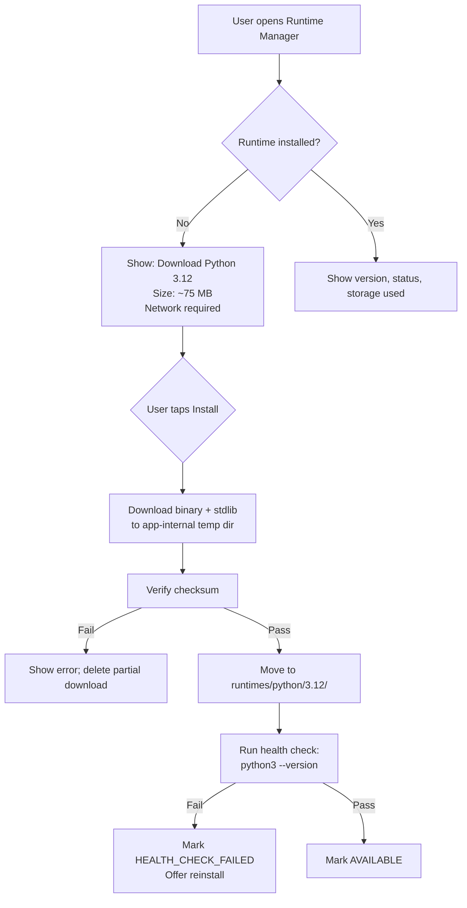

# 04 — Runtime System

**Project:** Mylonite IDE  
**Version:** 0.1 (Architecture Phase)  
**Status:** Pre-implementation  
**Last Updated:** 2026-08-30

---

## Table of Contents

1. [Runtime System Overview](#1-runtime-system-overview)
2. [Android Execution Constraints](#2-android-execution-constraints)
3. [Runtime Abstraction Layer](#3-runtime-abstraction-layer)
4. [RuntimeManager](#4-runtimemanager)
5. [Process Manager](#5-process-manager)
6. [Python Runtime](#6-python-runtime)
7. [JavaScript Runtime](#7-javascript-runtime)
8. [Environment and Working Directory](#8-environment-and-working-directory)
9. [stdin / stdout / stderr Handling](#9-stdin--stdout--stderr-handling)
10. [Process Cancellation and Timeouts](#10-process-cancellation-and-timeouts)
11. [Dependency and Package Management](#11-dependency-and-package-management)
12. [Runtime Installation and Versioning](#12-runtime-installation-and-versioning)
13. [Resource Limits](#13-resource-limits)
14. [Runtime Failures](#14-runtime-failures)
15. [Runtime Cleanup](#15-runtime-cleanup)
16. [DiagnosticsService Integration](#16-diagnosticsservice-integration)
17. [Future Runtimes](#17-future-runtimes)
18. [Open Questions](#18-open-questions)

---

## 1. Runtime System Overview

The Runtime System enables the IDE to execute user code locally on the Android device. It is one of the most technically challenging components because Android provides no runtime environments for general-purpose languages — no Python, no JavaScript, no shell. Everything the IDE needs must be either bundled in the application or downloaded and installed into the application's own storage.

The Runtime System is composed of:

- **`RuntimeInterface`** — The abstract contract every runtime implements
- **`RuntimeManager`** — Registers, discovers, and routes execution requests to the correct runtime
- **`ProcessManager`** — The low-level Android process spawning layer (Kotlin)
- **`PythonRuntime`** — CPython ARM64 implementation
- **`JavaScriptRuntime`** — QuickJS implementation (V1); Node.js ARM64 (future)
- **`DiagnosticsService`** — Parses runtime output to extract structured error information

```mermaid
flowchart TD
    AgentTool["Agent Tool (run_python / run_javascript)"]
    UserRun["User taps Run"]

    AgentTool --> RM
    UserRun --> RM

    subgraph RuntimeSystem["Runtime System"]
        RM[RuntimeManager]
        RTI[RuntimeInterface]
        PyR[PythonRuntime]
        JSR[JavaScriptRuntime]
        PM[ProcessManager\nKotlin]
        DS[DiagnosticsService]
    end

    RM --> RTI
    RTI --> PyR
    RTI --> JSR
    PyR --> PM
    JSR --> PM
    PM -->|stdout/stderr| DS
    PM -->|streams| TerminalScreen
    DS -->|Diagnostic[]| EditorController
```

---

## 2. Android Execution Constraints

Before defining the runtime architecture, it is essential to be explicit about what Android does and does not allow.

### 2.1 What Android Applications Can Do

- **Spawn child processes** using `ProcessBuilder` or `Runtime.exec()` from Kotlin/Java code. The child process inherits the application's UID and sandbox.
- **Read stdout, stderr, and stdin** of spawned child processes via standard Java `InputStream`/`OutputStream`.
- **Set the working directory** of a child process via `ProcessBuilder.directory()`.
- **Set environment variables** for child processes via `ProcessBuilder.environment()`.
- **Terminate child processes** via `Process.destroy()` (sends SIGTERM) or `Process.destroyForcibly()` (SIGKILL equivalent on Android).
- **Execute binaries** from the application's native library directory (`nativeLibraryDir`) — this directory is mounted with execute permission by Android.
- **Execute binaries** from other directories within app-private storage (`getFilesDir()`), **but only on devices and Android versions where those paths are not mounted `noexec`**. This is device-dependent and must be tested at runtime.

### 2.2 What Android Applications Cannot Do (Without Root)

- **Access system binaries** — `/bin`, `/usr/bin`, `/system/bin` (beyond Android's own system tools)
- **Modify the system PATH**
- **Install packages system-wide** (no `apt`, no system `pip`)
- **Execute binaries from external SD card** — external storage is typically mounted `noexec`
- **Fork processes with elevated privileges**
- **Create persistent background services** without explicit foreground service management
- **Use `ptrace`** on other processes

### 2.3 The `noexec` Problem

This is the central challenge of the Runtime System.

On Android, app-private storage (`/data/data/<package>/files/`) is on the `/data` partition. Some devices mount `/data` with the `noexec` flag, which prevents executing binaries directly from that path. The `nativeLibraryDir` (`/data/app/<package>/lib/arm64/`) is an exception — it is always executable.

**Strategies to work around `noexec`:**

| Strategy | Mechanism | Reliability |
|---|---|---|
| **Use nativeLibraryDir** | Ship the interpreter as a `.so` file named `libpython3.so`. Android installs it to `nativeLibraryDir` which is always `exec`. | High — used by Termux approach |
| **Runtime noexec check** | At first launch, attempt to `exec` a test binary from `getFilesDir()`. If it fails, fall back to nativeLibraryDir-based execution. | Medium — detection works; fallback adds complexity |
| **External storage** | Write binary to external storage (usually not `noexec`). | Low — external storage may not be available; `noexec` policies vary |
| **Shell via linker** | Invoke via `linker64 /path/to/binary args` — linker is in system's exec-able area. | Experimental — may not work reliably |

**Recommended approach for V1:**

Ship the Python interpreter binary as `libpython3.so` and any required shared libraries similarly named. Android installs all `.so` files from the APK's `lib/arm64-v8a/` directory into `nativeLibraryDir` at install time. The interpreter is then invoked via its full `nativeLibraryDir` path.

Supporting Python library files (`.py` stdlib) do not need to be executable — they are just data files loaded by the interpreter. They can live in `getFilesDir()` or be loaded from a zip archive.

### 2.4 APK Size Constraints

Shipping full runtime binaries inside an APK significantly inflates its size. Options:

| Approach | APK Size Impact | First-Use Experience |
|---|---|---|
| **Bundle Python in APK** | +50–100 MB | Immediate availability; no download needed |
| **Download on first use** | Minimal | Requires internet on first setup |
| **Hybrid: minimal interpreter in APK, stdlib download** | +10–15 MB | Fast startup; one-time stdlib download |
| **On-demand download (nothing bundled)** | Minimal | Requires internet; worst offline-first experience |

**Decision:** The minimal Python interpreter binary is shipped in the APK as a native `.so`. The Python standard library (`.pyc` files or a stdlib zip) is downloaded on first use and cached in app-internal storage. This balances APK size against offline availability. Once downloaded, the full runtime is available offline. A pre-download screen in setup flow informs the user of what will be downloaded and how much space it requires.

---

## 3. Runtime Abstraction Layer

### 3.1 RuntimeInterface

Every runtime implements this interface. The `RuntimeManager` and the agent's `run_python`/`run_javascript` tools interact only with this interface.

```
interface RuntimeInterface {
    // Runtime identity
    String get id               // e.g., "python", "javascript"
    String get displayName      // e.g., "Python 3.12"
    String get version          // e.g., "3.12.4"
    Language get language       // enum: PYTHON, JAVASCRIPT, ...
    RuntimeStatus get status    // AVAILABLE, NOT_INSTALLED, ERROR, etc.

    // Health check — verify the binary is present and functional
    Future<RuntimeHealthResult> checkHealth()

    // Execute a script file
    Future<ExecutionSession> execute(ExecutionRequest request)

    // Execute an inline snippet (wraps to temp file)
    Future<ExecutionSession> executeSnippet(SnippetRequest request)

    // Cancel a running execution session
    Future<void> cancel(String sessionId)

    // Get the status of a session
    ExecutionSessionStatus getSessionStatus(String sessionId)

    // Clean up resources for a completed session
    Future<void> cleanup(String sessionId)
}
```

### 3.2 ExecutionRequest

```
class ExecutionRequest {
    String sessionId            // Unique ID for this execution
    String scriptPath           // Absolute path to the script file
    String workingDirectory     // Working directory for the process
    List<String> args           // Command-line arguments
    Map<String, String> env     // Additional environment variables
    String? stdinInput          // Data to pipe to stdin (optional)
    int timeoutSeconds          // Execution timeout (default: 30)
    bool captureOutput          // Whether to capture or stream output (default: true)
}
```

### 3.3 ExecutionSession

```
class ExecutionSession {
    String sessionId
    Stream<OutputChunk> outputStream    // Combined stdout/stderr chunks
    Future<ExecutionResult> result      // Completes when process exits
    bool get isRunning
}

class OutputChunk {
    OutputType type     // STDOUT or STDERR
    String content
    DateTime timestamp
}

class ExecutionResult {
    String sessionId
    int exitCode
    String stdout           // Full captured stdout
    String stderr           // Full captured stderr
    bool timedOut
    int executionTimeMs
    List<Diagnostic> diagnostics    // Parsed from stderr
}
```

### 3.4 RuntimeStatus

```
enum RuntimeStatus {
    AVAILABLE,          // Ready to execute
    NOT_INSTALLED,      // Binary not present; download required
    INSTALLING,         // Download/install in progress
    HEALTH_CHECK_FAILED, // Binary exists but fails health check
    RUNNING,            // A session is currently active
    ERROR               // Unrecoverable error state
}
```

---

## 4. RuntimeManager

### 4.1 Responsibilities

- Maintains a registry of all installed `RuntimeInterface` implementations
- Routes `execute()` calls to the correct runtime by language/ID
- Tracks all active `ExecutionSession` objects
- Enforces that only one execution session per runtime is active at a time (V1 constraint — prevents resource exhaustion)
- Provides status information to the UI (Runtime Manager screen)

### 4.2 Runtime Registration

Runtimes are registered at application startup:

```
RuntimeManager.register(PythonRuntime())
RuntimeManager.register(JavaScriptRuntime())
// Future: RuntimeManager.register(TypeScriptRuntime())
```

A runtime that fails its `checkHealth()` on registration is marked `HEALTH_CHECK_FAILED` but remains registered. The UI can trigger a repair/reinstall flow.

### 4.3 Execution Routing

```
RuntimeManager.execute(request):
    runtime = findRuntimeByLanguage(request.language)
    
    if runtime == null:
        return ExecutionError(RUNTIME_NOT_FOUND)
    
    if runtime.status == NOT_INSTALLED:
        return ExecutionError(RUNTIME_NOT_INSTALLED, installPrompt=true)
    
    if runtime.status == RUNNING:
        return ExecutionError(RUNTIME_BUSY)
    
    return runtime.execute(request)
```

### 4.4 Concurrent Execution

V1 allows one active execution session per runtime. Attempting to start a second Python session while one is running returns `RUNTIME_BUSY`. The user must stop the running session first.

This simplification avoids complex process and resource management. Post-V1 may allow limited concurrency (e.g., running tests while viewing output).

---

## 5. Process Manager

The `ProcessManager` is the Kotlin layer that actually spawns and manages child processes. It is accessed from the Dart layer via Platform Channel (`ide/process`).

### 5.1 Process Spawning

```kotlin
// Kotlin side of ProcessManager
class ProcessManager {
    fun spawnProcess(request: ProcessSpawnRequest): ProcessHandle {
        val pb = ProcessBuilder(request.argv)
            .directory(File(request.workingDirectory))
            .redirectErrorStream(false)
        
        // Apply environment
        val env = pb.environment()
        request.environment.forEach { (k, v) -> env[k] = v }
        
        val process = pb.start()
        val pid = process.pid()
        
        // Start reader threads for stdout/stderr
        startOutputReader(process.inputStream, pid, OutputType.STDOUT)
        startOutputReader(process.errorStream, pid, OutputType.STDERR)
        
        // Handle stdin if provided
        request.stdinInput?.let {
            process.outputStream.write(it.toByteArray())
            process.outputStream.close()
        }
        
        return ProcessHandle(pid, process)
    }
}
```

### 5.2 Output Streaming

Output from child processes is streamed back to Dart via an `EventChannel`. This means the terminal and the agent's tool result both see output as it arrives, not buffered until process exit.

```
ProcessManager (Kotlin)
    └── OutputReader thread per stream (stdout/stderr)
        └── reads chunks from InputStream
        └── emits via EventChannel: ide/process/output
            └── Dart receives as Stream<OutputChunk>
```

Output chunks include a timestamp and stream type. The TerminalScreen renders them in order.

### 5.3 Process Lifecycle Tracking

The `ProcessManager` maintains a map of `pid → ProcessHandle`. Each handle tracks:
- The `Process` object
- Start time
- Current status (RUNNING, TERMINATED, TIMED_OUT)
- Accumulated stdout and stderr (for final result assembly)

### 5.4 Foreground Service

For executions expected to run longer than approximately 30 seconds, the `ProcessManager` starts a `ForegroundService` via `startForeground()`. This prevents Android from killing the process when the app goes to the background.

The foreground service shows a notification:
- "Code is running..." with a Stop button
- Dismissible only when the process completes or is cancelled

For executions that complete quickly (< 30 seconds by the runtime's estimation), no foreground service is started. If a "quick" execution exceeds 30 seconds, the service is started retroactively.

---

## 6. Python Runtime

### 6.1 Implementation Strategy

**Decision:** CPython ARM64 prebuilt binary.

CPython is the reference Python implementation and the only one that guarantees compatibility with the Python ecosystem (C extension modules, pip, virtualenv). PyPy is not a viable option for Android ARM64 (JIT compilation on Android is restricted). Micropython lacks stdlib coverage.

The approach used by Termux — shipping CPython as a native library and bootstrapping the stdlib — is the proven path. The Python Android team has also made significant strides in official Android support starting with Python 3.13 (`android` platform target in CPython's build system).

**Binary source options:**

| Source | Reliability | Maintenance | Notes |
|---|---|---|---|
| Termux-built CPython ARM64 | High | Community-maintained | Proven; large ecosystem of packages already built |
| Official CPython Android builds (3.13+) | High | CPython core team | Official support; less ecosystem history |
| Custom build from source | High | Self-maintained | Full control; significant build infrastructure required |
| Chaquopy-distributed | Medium | Third-party commercial | Good tooling; commercial license for app distribution |

**Decision:** Target CPython 3.12 or 3.13 official Android builds, falling back to Termux-built binaries if official builds are insufficient. The exact source is a Phase 5 investigation item.

### 6.2 Python Binary Layout

```
app-internal storage:
    runtimes/
        python/
            3.12/
                bin/
                    python3              ← interpreter binary (or symlink from nativeLibraryDir)
                lib/
                    python3.12/
                        *.py             ← standard library source
                        lib-dynload/
                            *.so         ← C extension modules
                    libpython3.12.so     ← shared library
                include/
                    python3.12/          ← headers (not needed at runtime)

nativeLibraryDir:
    libpython3.so                        ← interpreter entry point (installed by APK)
    libpython3.12.so                     ← Python shared library
```

### 6.3 Python Environment Variables

When executing a Python script, the following environment variables are set:

| Variable | Value | Purpose |
|---|---|---|
| `PYTHONHOME` | `runtimes/python/3.12/` | Tells Python where its stdlib lives |
| `PYTHONPATH` | `project_root:runtimes/python/3.12/lib/python3.12/` | Module search path |
| `PYTHONDONTWRITEBYTECODE` | `1` | Prevents `.pyc` file creation in project dirs |
| `HOME` | `app-internal storage root` | Required by some stdlib modules |
| `TMPDIR` | `app-internal/tmp/` | Temp directory (system `/tmp` unavailable) |
| `LD_LIBRARY_PATH` | `runtimes/python/3.12/lib:nativeLibraryDir` | Shared library search path |
| `PATH` | `runtimes/python/3.12/bin` | For subprocesses that use PATH |

### 6.4 Python Execution Flow

```
PythonRuntime.execute(request)
    │
    ├── validate scriptPath exists and is .py
    ├── build argv: [python3_binary_path, scriptPath, ...request.args]
    ├── build env: base_env + project-specific vars
    ├── set workingDirectory = project root
    │
    ▼
ProcessManager.spawnProcess(argv, env, workDir)
    │
    ├── Kotlin ProcessBuilder
    ├── pipes: stdin (if stdinInput provided), stdout, stderr
    │
    ▼
ExecutionSession (streaming)
    │
    ├── stdout → TerminalScreen (live)
    ├── stderr → TerminalScreen (live)
    ├── both → DiagnosticsService.parse()
    │
    ▼
Process exits
    │
    ├── collect exit code
    ├── assemble ExecutionResult
    └── return to caller
```

### 6.5 Python Startup Time

CPython's startup involves importing the `site` module, scanning `sys.path`, and initializing the interpreter. On Android, this is slower than desktop because of slower I/O.

**Mitigation strategies:**

- Use `python3 -S` flag (skip site import) for agent-executed scripts where the stdlib is not needed
- Pre-compile stdlib to `.pyc` files to reduce startup parse time
- Consider embedding Python as a shared library and calling `Py_Initialize()` / `Py_Finalize()` from JNI for a persistent interpreter process (avoids spawn overhead) — this is a post-V1 optimization

**Startup time target:** See PERF-009 / PERF-010 in `01-REQUIREMENTS.md`.

### 6.6 Python Version Management

V1 ships one Python version (3.12 or 3.13). Version selection is not user-exposed in V1. The architecture uses a versioned directory structure (`runtimes/python/3.12/`) to support multiple versions in future without conflicts.

---

## 7. JavaScript Runtime

### 7.1 V1: QuickJS

**Rationale for QuickJS:** See ADR-003 in `02-ARCHITECTURE.md`.

QuickJS is a small, embeddable JavaScript engine by Fabrice Bellard (original author of QEMU and FFmpeg). Key properties:

- Full ES2020 compliance
- ARM64 support
- Compiled to a single binary (~200 KB) or shared library
- Supports import/require (module system)
- No JIT (pure interpreter) — lower performance than V8 but no JIT-related Android restrictions
- No npm compatibility in standalone form

### 7.2 QuickJS Deployment

QuickJS is deployed as:
1. A native shared library `libquickjs.so` shipped in the APK and installed to `nativeLibraryDir`
2. The `qjs` command-line binary (or its equivalent) invoked via `ProcessManager` in the same way as Python

Alternatively, QuickJS can be embedded as a library and called via JNI without spawning a child process, which reduces startup overhead. The V1 decision between these two modes is a Phase 6 investigation item.

### 7.3 JavaScript Environment

| Variable | Value |
|---|---|
| Working directory | Project root |
| Module resolution | Project root + a minimal standard library in app storage |
| `console.log` | Mapped to stdout |
| `console.error` | Mapped to stderr |

### 7.4 JavaScript Execution Flow

Identical in structure to the Python execution flow, substituting `qjs` binary for `python3`. Same `ProcessManager`, same output streaming, same `DiagnosticsService` parsing (with JavaScript-specific error patterns).

### 7.5 Future: Node.js ARM64

Node.js ARM64 is the path to npm compatibility. Investigation required:

| Question | Status |
|---|---|
| Is an official Node.js ARM64 Android binary available? | Requires Investigation |
| What is the binary + runtime size? | ~40–80 MB estimated |
| Can it be invoked from app-internal storage? | Likely (same `nativeLibraryDir` trick) |
| Does npm work with app-internal node_modules? | Requires Investigation |
| Can native npm packages (C extensions) be installed? | Experimental — pre-built binaries only |

If Node.js ARM64 is adopted in a future phase, it registers as a second `JavaScriptRuntime` variant. The `RuntimeManager` can route based on project configuration (QuickJS for lightweight scripts; Node.js for npm-based projects).

### 7.6 TypeScript

TypeScript support will be handled by transpilation to JavaScript, not a native TypeScript interpreter. A post-V1 `TypeScriptRuntime` would:
1. Run `tsc` (TypeScript compiler) to produce `.js` output
2. Feed the `.js` to the JavaScript runtime
3. Map error messages back to the original `.ts` file/line numbers

TypeScript compiler ARM64 binary availability requires investigation.

---

## 8. Environment and Working Directory

### 8.1 Working Directory

All executions use the project root as the working directory. Scripts can reference other project files by relative path. They cannot navigate above the project root using `../` (the Python/JS runtime itself does not enforce this — this is a process-level constraint that works by convention, not hard enforcement in V1).

**Note:** Unlike path traversal attacks via the agent tool system (which are blocked by `WorkspaceManager`), a script itself could read arbitrary files if the Python code contains `open("/data/data/...")`. This is a runtime sandbox limitation documented in `06-SECURITY.md`. Mitigations exist (seccomp, SELinux policies) but are not implemented in V1.

### 8.2 Environment Variable Isolation

Each execution gets a clean environment derived from the runtime's base environment. The host Android environment variables are **not** passed through to child processes. This prevents leaking sensitive environment information.

The base environment for each runtime contains only what the runtime requires (see Sections 6.3 and 7.3). The user can define project-level environment variables in a `.env` file at the project root; the IDE reads this and passes those variables to child processes.

---

## 9. stdin / stdout / stderr Handling

### 9.1 stdout and stderr

Both are captured and streamed simultaneously. They are not merged at the process level (`redirectErrorStream(false)` ensures they remain separate). Each `OutputChunk` is tagged with its type.

The terminal displays them interleaved in arrival order, with stderr displayed in a different color to distinguish it from stdout.

### 9.2 stdin

For interactive programs, stdin is supported in two ways:

1. **Pre-supplied stdin:** The `ExecutionRequest.stdinInput` field allows the caller (including the agent tool) to supply a complete stdin string. The string is written to the process's stdin pipe and the pipe is closed. This enables non-interactive execution of programs that read from stdin.

2. **Interactive stdin:** The terminal UI provides an input field that allows the user to type and send lines to a running process's stdin pipe. This is the interactive terminal mode.

The agent's `run_python` tool supports pre-supplied stdin (option 1). Interactive stdin is user-only.

### 9.3 Output Buffer Limits

To prevent memory exhaustion from programs that produce enormous output:
- Streaming display: unlimited (chunks are displayed and discarded)
- Captured result (stored in `ExecutionResult.stdout`/`.stderr`): limited to 1 MB each
- If the limit is exceeded, output is truncated and a warning is appended

---

## 10. Process Cancellation and Timeouts

### 10.1 User-Initiated Cancellation

```
User taps Stop / Agent calls cancel(sessionId)
    ↓
RuntimeManager.cancel(sessionId)
    ↓
Runtime.cancel(sessionId) → ProcessManager.terminate(pid)
    ↓
Kotlin: process.destroy()          // SIGTERM-equivalent
    ↓
Wait 2000ms
    ↓
If process still running:
    process.destroyForcibly()      // SIGKILL-equivalent
    ↓
Close stdin/stdout/stderr streams
    ↓
ExecutionSession.result completes with:
    exitCode = -1 (or OS-reported kill signal code)
    timedOut = false
    (stdout/stderr accumulated up to cancellation point)
```

### 10.2 Timeout Enforcement

```
ProcessManager.spawnProcess(request):
    ...
    // Set up timeout watchdog
    Future.delayed(Duration(seconds: request.timeoutSeconds), () {
        if process.isAlive():
            terminate(pid)
            markTimedOut(pid)
    })
```

When timeout fires:
- Process is terminated (same sequence as cancellation)
- `ExecutionResult.timedOut = true`
- `exitCode` set to a sentinel value indicating timeout

The agent's `run_python`/`run_javascript` tools have a configurable `timeout_seconds` parameter. The default is 30 seconds; the maximum is 120 seconds. The `ToolRegistry` enforces these limits — a tool call requesting a timeout above the maximum is clamped.

### 10.3 Timeout Values

| Context | Default Timeout | Maximum |
|---|---|---|
| Agent tool call (run_python) | 30 seconds | 120 seconds |
| Agent tool call (run_javascript) | 30 seconds | 120 seconds |
| User-initiated run (UI) | 300 seconds | User-configurable |
| Runtime health check | 5 seconds | 5 seconds |

---

## 11. Dependency and Package Management

### 11.1 Python Package Management

#### pip

`pip` is bundled alongside CPython. Package installation works by running:
```
python3 -m pip install <package> --target <project_packages_dir>
```

where `<project_packages_dir>` is a directory within the project workspace (e.g., `my_project/.packages/`). This is equivalent to a local install that doesn't require system-wide write access.

The `PYTHONPATH` for execution is extended to include `.packages/` so installed packages are importable.

#### Virtual Environments

`venv` / `virtualenv` creates a self-contained Python environment. On Android this is technically feasible but requires the environment to reference the bundled Python interpreter rather than a system interpreter. Investigation required to confirm reliable virtualenv behaviour in the app-internal storage path.

**V1 approach:** Use `--target` pip installs into `.packages/` per project. True virtual environments are a post-V1 refinement.

#### Native Python Packages

Packages with C extensions (e.g., numpy, cryptography, Pillow) cannot be installed via pip on-device in V1 because:
1. There is no C compiler on Android
2. pip would try to compile from source

**V1 limitation:** Only pure-Python packages can be installed via pip. Pre-built ARM64 wheels for common packages (numpy, etc.) are a future consideration. The UI must clearly communicate this limitation when a pip install fails with a compilation error.

#### Network Requirement for pip

pip requires internet access to download packages from PyPI. This is consistent with the offline-first philosophy: core functionality (running code already written) works offline, but installing new packages requires connectivity. The `NetworkMode` setting can be used to warn users before attempting package installation in OFFLINE mode.

### 11.2 JavaScript Package Management (Post-V1)

npm requires Node.js (V1 uses QuickJS). When Node.js ARM64 is integrated:

```
npm install --prefix <project_root>
```

This creates `node_modules/` inside the project directory. npm requires network access for downloads.

**V1:** No package management for JavaScript. Only the JS standard library (built into QuickJS) and files in the project directory are available.

### 11.3 Storage Implications

Package installation can consume significant storage:
- `requests` (pure Python): ~200 KB
- `numpy` (wheel, ARM64): ~15–20 MB
- `django` (pure Python): ~10–15 MB

The IDE must display available and used storage before package operations and warn the user when storage is low.

---

## 12. Runtime Installation and Versioning

### 12.1 Installation Flow



### 12.2 Checksum Verification

All downloaded runtime binaries are verified against a SHA-256 checksum before installation. Checksums are obtained from the official source alongside the binary. If the checksum does not match, the download is rejected and deleted.

### 12.3 Runtime Metadata

Runtime metadata is stored as a JSON file at `runtimes/python/3.12/runtime.json`:

```json
{
  "id": "python",
  "language": "python",
  "version": "3.12.4",
  "displayName": "Python 3.12.4",
  "architecture": "arm64-v8a",
  "installedAt": "2026-08-30T12:00:00Z",
  "storageBytes": 78643200,
  "executablePath": "runtimes/python/3.12/bin/python3",
  "checksum": "sha256:abc123...",
  "checksumVerified": true,
  "status": "AVAILABLE"
}
```

### 12.4 Multiple Versions

The versioned directory structure (`runtimes/python/3.12/`, `runtimes/python/3.13/`) supports multiple installed versions. In V1, only one version is active at a time per language. The `RuntimeManager` uses the version specified in project metadata, falling back to the default version.

### 12.5 Runtime Updates

Runtime updates work by downloading the new version to a versioned directory and running a health check. The old version remains until the user explicitly removes it. This prevents being left without a working runtime during an upgrade.

---

## 13. Resource Limits

### 13.1 Memory Limits

Child processes inherit the parent process's address space but are independent processes. Android's OOM killer can kill child processes independently of the main app.

- **V1:** No explicit memory limit is set on child processes. This is a known risk: a runaway Python script allocating large amounts of memory could trigger the OOM killer.
- **Mitigation in V1:** The execution timeout (Section 10.2) limits the duration of runaway allocations. Post-V1 may use Android's `prlimit` (if available) via the `setrlimit` syscall from a native shim.

### 13.2 CPU Limits

No CPU limit is set on child processes in V1. Thermal throttling by the Android thermal framework will naturally limit sustained CPU usage. The `ThermalMonitor` in the application can warn the user when the device is throttling.

### 13.3 Network Access from Running Code

Scripts can make network requests (Python `urllib`, `requests`; JS `fetch` in future Node.js). In V1 there is no network restriction applied to child processes. This is a security consideration documented in `06-SECURITY.md`. Network sandboxing is a post-V1 security hardening item.

### 13.4 File System Access from Running Code

Scripts can access any file that the parent application can access. A Python script in a project could `open("/data/data/<package>/models/my_model.gguf", "r")` and read the AI model file if it knows the path.

**V1 mitigation:** The working directory is the project root, which reduces the likelihood of accidental wide-scope file access. Deliberate misuse is a security concern documented in `06-SECURITY.md`.

---

## 14. Runtime Failures

### 14.1 Failure Categories

| Failure | Cause | Response |
|---|---|---|
| `RUNTIME_NOT_INSTALLED` | Binary not present | Prompt to install |
| `HEALTH_CHECK_FAILED` | Binary present but fails `--version` | Offer reinstall |
| `PROCESS_SPAWN_FAILED` | `ProcessBuilder.start()` throws | Log; surface "Could not start process" |
| `EXECUTION_TIMEOUT` | Process exceeded timeout | Kill process; return timeout result |
| `OUT_OF_MEMORY` | OOM killer killed process | Detect exit code 137 (SIGKILL); surface OOM warning |
| `NOEXEC_ERROR` | Binary not executable from storage path | Attempt fallback to `nativeLibraryDir`; log critical error |
| `STDLIB_MISSING` | Python stdlib not found | Prompt to re-download stdlib |
| `RUNTIME_BUSY` | Session already active | Return busy error; user must stop current execution |

### 14.2 Detecting OOM Kill

Android's OOM killer sends SIGKILL to processes. The exit code received by the parent is typically 137 (128 + 9). The `ProcessManager` should detect exit code 137 and surface an OOM warning rather than a generic "process exited with code 137" message.

### 14.3 Error Surface

All runtime failures are converted to structured `RuntimeError` objects. They are:
- Logged by `LoggingService` with subsystem tag `RUNTIME`
- Propagated to the calling layer (agent tool or UI)
- Displayed in the terminal output area with a clear human-readable message

---

## 15. Runtime Cleanup

### 15.1 Per-Session Cleanup

After each execution session completes:
- stdout/stderr reader threads are joined
- stdin pipe is closed
- The `Process` object is released
- Temporary files created for snippet execution are deleted
- The session is removed from the `ProcessManager` active sessions map

### 15.2 On-App-Exit Cleanup

When the application is being destroyed (Android `onDestroy`):
- All running processes are terminated (`destroyForcibly()`)
- Foreground services are stopped
- Temp files are deleted

### 15.3 Orphan Process Detection

If the application crashes without cleanup, child processes may continue running. On application restart, the `ProcessManager` checks for orphaned processes by attempting to read the PID file written at process start. If a process with that PID is still running and belongs to this application, it is terminated.

---

## 16. DiagnosticsService Integration

The `DiagnosticsService` parses runtime output to extract structured error information.

### 16.1 Python Error Patterns

| Error Type | Detection Pattern |
|---|---|
| SyntaxError | `File "X.py", line N\n...\nSyntaxError: message` |
| Traceback | `Traceback (most recent call last):\n  File "X.py", line N, in <func>` |
| NameError / TypeError / etc. | Same traceback format, different exception class |
| pip install error | `error: ...` lines from pip output |

**Parsed Diagnostic example:**
```json
{
  "file": "main.py",
  "line": 5,
  "column": null,
  "severity": "error",
  "message": "SyntaxError: invalid syntax",
  "source": "runtime"
}
```

### 16.2 JavaScript Error Patterns (QuickJS)

QuickJS outputs errors in the format:
```
file.js:10: TypeError: cannot read property 'x' of undefined
```

Pattern: `<file>:<line>: <ErrorType>: <message>`

### 16.3 Diagnostic Lifecycle

Diagnostics are:
1. Parsed from runtime output immediately as chunks arrive
2. Stored in an in-memory `DiagnosticsBuffer` keyed by file path
3. Pushed to `EditorController` after execution completes
4. Displayed as inline markers in the editor
5. Cleared when a new execution for the same file begins

---

## 17. Future Runtimes

The `RuntimeInterface` design makes adding new runtimes straightforward. Anticipated future additions:

| Runtime | Notes |
|---|---|
| Node.js ARM64 | For npm support; replaces/supplements QuickJS |
| TypeScript | Transpile → JS; needs tsc ARM64 |
| Java (via OpenJDK for Android) | Complex; large binary; post-V1 |
| Kotlin (via Kotlin compiler) | Requires JVM; very post-V1 |
| C (via clang cross-compile) | Would produce ARM64 binaries; highly experimental |
| Dart (using Flutter's embedded Dart VM) | Interesting but complex |

None of these require changes to the RuntimeManager, AgentController, or any other subsystem. Each is a new class implementing `RuntimeInterface`.

---

## 18. Open Questions

| # | Question | Impact | Phase |
|---|---|---|---|
| RQ-001 | Which specific CPython ARM64 build source will be used? Official Python 3.13 Android builds or Termux? | High — affects binary size, maintenance, ecosystem | Phase 5 |
| RQ-002 | Does `getFilesDir()` support exec on target devices? Or is `nativeLibraryDir` required? | High — affects deployment architecture | Phase 4 |
| RQ-003 | What is the actual startup time of CPython 3.12 ARM64 on a Snapdragon 7-series device? | Medium — affects UX targets | Phase 5 |
| RQ-004 | Can `venv` create functional virtual environments within app-internal storage? | Medium — affects pip workflow | Phase 5 |
| RQ-005 | Is QuickJS best invoked as a subprocess or embedded via JNI/FFI? | Medium — affects JS startup time | Phase 6 |
| RQ-006 | What is the feasibility and binary size of a Node.js ARM64 Android build? | Medium — affects FUT-003 (npm) | Phase 6+ |
| RQ-007 | Can pre-built ARM64 wheels for common packages (numpy, Pillow) be distributed within the app? | Low for V1, high for ecosystem | Post-V1 |
| RQ-008 | How should the PYTHONHOME/PYTHONPATH interact with project-installed packages? | Medium — affects pip install flow | Phase 5 |

---

*Next: `05-OFFLINE-AI.md` — Local AI inference engine, model formats, quantization, device tiers, memory management, and streaming.*
