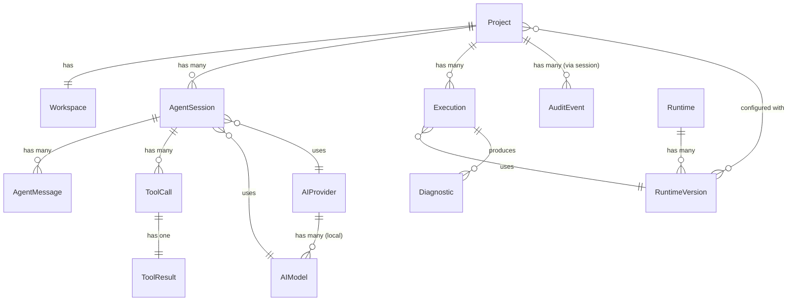

# 07 — Data Models

**Project:** Mylonite IDE  
**Version:** 0.1 (Architecture Phase)  
**Status:** Pre-implementation  
**Last Updated:** 2026-08-30

---

## Table of Contents

1. [Conventions](#1-conventions)
2. [Storage Strategy Overview](#2-storage-strategy-overview)
3. [Entity Relationship Overview](#3-entity-relationship-overview)
4. [Project](#4-project)
5. [Workspace](#5-workspace)
6. [File](#6-file)
7. [Runtime](#7-runtime)
8. [RuntimeVersion](#8-runtimeversion)
9. [AIProvider](#9-aiprovider)
10. [AIModel](#10-aimodel)
11. [AgentSession](#11-agentsession)
12. [AgentMessage](#12-agentmessage)
13. [ToolCall](#13-toolcall)
14. [ToolResult](#14-toolresult)
15. [Conversation](#15-conversation)
16. [Execution](#16-execution)
17. [Diagnostic](#17-diagnostic)
18. [Settings](#18-settings)
19. [AuditEvent](#19-auditevent)
20. [Model Relationships Summary](#20-model-relationships-summary)
21. [Storage Layout](#21-storage-layout)

---

## 1. Conventions

### 1.1 Field Types

| Type | Description |
|---|---|
| `string` | UTF-8 text |
| `uuid` | Version 4 UUID string |
| `timestamp` | ISO 8601 datetime string (e.g., `"2026-08-30T12:00:00Z"`) |
| `integer` | 32-bit signed integer |
| `long` | 64-bit signed integer |
| `boolean` | `true` or `false` |
| `enum(...)` | One of the listed string values |
| `string[]` | List of strings |
| `map<K,V>` | Key-value pairs |
| `bytes` | Raw byte count (stored as long integer) |
| `?` suffix | Nullable / optional field |

### 1.2 Model Notation

Each model is presented as:
- **Purpose** — what the model represents
- **Fields** — name, type, required/optional, description
- **Relationships** — references to other models
- **Persistence** — how and where it is stored
- **Lifecycle** — when it is created, updated, and deleted

### 1.3 Technology Neutrality

Data models are defined at the conceptual level. They do not assume a specific storage format (JSON, SQLite, binary). The implementation may serialize these to JSON files, embed them in SQLite, or use another format as appropriate. The field names and types here are the canonical definitions; serialized names may differ.

---

## 2. Storage Strategy Overview

As established in `02-ARCHITECTURE.md` (ADR-005), V1 uses structured JSON files for persistence rather than a relational database. This section maps each model to its storage strategy.

| Model | Storage | Location | Format |
|---|---|---|---|
| Project | Per-project JSON | `projects/<id>/project.json` | JSON |
| Workspace | Derived from Project | (same as Project) | — |
| File | Filesystem (real files) | `projects/<id>/workspace/` | Native |
| Runtime | Per-runtime JSON | `runtimes/<lang>/<version>/runtime.json` | JSON |
| RuntimeVersion | Part of Runtime | (same as Runtime) | — |
| AIProvider | Part of Settings | `settings/providers.json` | JSON |
| AIModel | Per-model JSON | `models/<id>/metadata.json` | JSON |
| AgentSession | Per-session JSON | `projects/<id>/sessions/<sid>.json` | JSON |
| AgentMessage | Part of AgentSession | (same as AgentSession) | — |
| ToolCall | Part of AgentSession | (same as AgentSession) | — |
| ToolResult | Part of AgentSession | (same as AgentSession) | — |
| Conversation | Part of AgentSession | (same as AgentSession) | — |
| Execution | Per-execution JSON (recent) | `projects/<id>/executions/<eid>.json` | JSON |
| Diagnostic | In-memory + part of Execution | Runtime only (not persisted separately) | — |
| Settings | Global JSON | `settings/settings.json` | JSON |
| AuditEvent | Part of AuditLog JSON | `projects/<id>/audit/<sid>.json` | JSON |

---

## 3. Entity Relationship Overview



---

## 4. Project

**Purpose:** Represents a user's software project. The top-level container for all project-specific data including workspace files, sessions, executions, and settings.

### Fields

| Field | Type | Required | Description |
|---|---|---|---|
| `id` | uuid | Yes | Unique project identifier |
| `name` | string | Yes | Human-readable project name (e.g., "My Calculator") |
| `description` | string? | No | Optional short description |
| `primaryLanguage` | enum(python, javascript, mixed, other) | Yes | Primary programming language |
| `createdAt` | timestamp | Yes | When the project was created |
| `lastOpenedAt` | timestamp? | No | When the project was last opened; null if never |
| `lastModifiedAt` | timestamp | Yes | When any project file was last modified |
| `workspacePath` | string | Yes | Absolute path to the workspace root directory |
| `metadataPath` | string | Yes | Absolute path to the project metadata directory |
| `defaultRuntimeId` | string? | No | ID of the preferred runtime for this project |
| `defaultModelId` | string? | No | ID of the preferred AI model for this project |
| `tags` | string[] | No | User-defined tags for organization |
| `entryPoint` | string? | No | Relative path to the main entry file (e.g., `main.py`) |
| `status` | enum(active, archived) | Yes | Whether the project is active or archived |
| `schemaVersion` | integer | Yes | Version of this metadata schema (for future migrations) |

### Relationships

- Contains one `Workspace` (the directory at `workspacePath`)
- Has many `AgentSession` records
- Has many `Execution` records
- References one optional `RuntimeVersion` (via `defaultRuntimeId`)
- References one optional `AIModel` (via `defaultModelId`)

### Persistence

Stored as `projects/<project-id>/project.json`. The `id` is also the directory name.

### Lifecycle

- **Created:** When user creates a new project (ProjectManager.createProject)
- **Updated:** When project is renamed, entry point changes, last opened time updates
- **Archived:** When user archives (soft delete); directory remains
- **Deleted:** When user explicitly deletes; entire `projects/<id>/` directory removed after confirmation

---

## 5. Workspace

**Purpose:** Represents the filesystem structure of a project. The workspace is not a separate persisted entity — it is the real directory on the filesystem described by `Project.workspacePath`. The `WorkspaceManager` provides an in-memory representation of the current workspace state.

### Derived (In-Memory) Properties

| Property | Type | Description |
|---|---|---|
| `projectId` | uuid | The owning project's ID |
| `rootPath` | string | Absolute filesystem path to the workspace root |
| `fileTree` | FileNode[] | In-memory tree of files and directories |
| `isDirty` | boolean | Whether any open file has unsaved changes |
| `openFiles` | string[] | Relative paths of currently open files |

### Notes

The workspace is not persisted as a separate JSON file. The actual files in the directory *are* the workspace. The `fileTree` is rebuilt by scanning the filesystem each time the workspace is opened.

### Lifecycle

- **Initialized:** When the project is opened (WorkspaceManager.openProject)
- **Updated:** On every file operation (create, write, delete, rename)
- **Cleared:** When the project is closed

---

## 6. File

**Purpose:** Represents a single file within a project workspace. Files are real filesystem objects — this model is used for in-memory representation, search results, and diagnostics references.

### In-Memory Fields

| Field | Type | Description |
|---|---|---|
| `relativePath` | string | Path relative to workspace root (e.g., `src/utils.py`) |
| `absolutePath` | string | Absolute filesystem path |
| `name` | string | Filename only (e.g., `utils.py`) |
| `extension` | string | File extension without dot (e.g., `py`) |
| `language` | enum(python, javascript, text, markdown, json, other) | Detected language |
| `sizeBytes` | long | Current file size |
| `lastModified` | timestamp | Filesystem last-modified time |
| `isDirectory` | boolean | True if this is a directory entry |
| `isDirty` | boolean | True if the file has unsaved changes in the editor |
| `diagnostics` | Diagnostic[] | Current diagnostics for this file (in-memory only) |

### Persistence

Files are real filesystem files. No separate metadata record is stored per file. File metadata is read from the filesystem (`File.lastModified()`, `File.length()`, etc.) when needed.

### Lifecycle

- **Created:** When the user or agent creates a new file
- **Modified:** When the user or agent writes to the file
- **Deleted:** When the user or agent deletes the file (with confirmation)
- **Renamed:** When the user or agent renames the file

---

## 7. Runtime

**Purpose:** Represents a language runtime that can execute code in this application. Each runtime corresponds to a language interpreter installation managed by the RuntimeManager.

### Fields

| Field | Type | Required | Description |
|---|---|---|---|
| `id` | string | Yes | Unique identifier (e.g., `"python"`, `"javascript"`) |
| `language` | enum(python, javascript) | Yes | The language this runtime executes |
| `displayName` | string | Yes | Human-readable name (e.g., `"Python"`) |
| `installedVersions` | RuntimeVersion[] | Yes | All installed versions of this runtime |
| `activeVersionId` | string? | No | ID of the currently active version |
| `status` | enum(AVAILABLE, NOT_INSTALLED, INSTALLING, ERROR) | Yes | Current runtime system status |

### Relationships

- Has many `RuntimeVersion` records
- Referenced by `Project.defaultRuntimeId`
- Referenced by `Execution.runtimeId`

### Persistence

The `Runtime` entity is a logical grouping. Its state is derived from the installed `RuntimeVersion` records on disk. There is no separate `runtime.json` at the language level — `RuntimeManager` assembles this from the version-level metadata files.

---

## 8. RuntimeVersion

**Purpose:** Represents a specific version of a runtime that has been installed on the device.

### Fields

| Field | Type | Required | Description |
|---|---|---|---|
| `id` | string | Yes | Unique version identifier (e.g., `"python-3.12.4"`) |
| `runtimeId` | string | Yes | Parent runtime ID (e.g., `"python"`) |
| `version` | string | Yes | Semantic version string (e.g., `"3.12.4"`) |
| `architecture` | enum(arm64-v8a, armeabi-v7a) | Yes | Binary architecture |
| `executablePath` | string | Yes | Absolute path to the interpreter binary |
| `homePath` | string | Yes | Absolute path to the runtime home directory (PYTHONHOME equivalent) |
| `installedAt` | timestamp | Yes | When this version was installed |
| `sizeBytes` | long | Yes | Total on-disk size of this version |
| `checksum` | string | Yes | SHA-256 of the original download archive |
| `checksumVerified` | boolean | Yes | Whether checksum was verified at install time |
| `source` | string | Yes | Download source URL or `"bundled"` |
| `status` | enum(AVAILABLE, HEALTH_CHECK_FAILED, INSTALLING, ERROR) | Yes | Operational status |
| `lastHealthCheck` | timestamp? | No | Time of last health check |
| `packageManagerPath` | string? | No | Path to pip / npm binary, if available |
| `schemaVersion` | integer | Yes | Metadata schema version |

### Persistence

Stored as `runtimes/<language>/<version>/runtime.json`. Example: `runtimes/python/3.12.4/runtime.json`.

### Lifecycle

- **Created:** When user installs a runtime via Runtime Manager
- **Updated:** When health check runs; when status changes
- **Deleted:** When user removes the runtime version via Runtime Manager

---

## 9. AIProvider

**Purpose:** Represents a configured AI provider (local or cloud). Providers implement the `AIProvider` interface in application code. This model captures the user-facing configuration for each provider.

### Fields

| Field | Type | Required | Description |
|---|---|---|---|
| `id` | string | Yes | Unique identifier (e.g., `"local"`, `"gemini"`, `"openai"`) |
| `type` | enum(local, gemini, openai, custom) | Yes | Provider type |
| `displayName` | string | Yes | Human-readable name (e.g., `"Local (llama.cpp)"`) |
| `isEnabled` | boolean | Yes | Whether this provider is enabled |
| `isConfigured` | boolean | Yes | Whether all required configuration is present |
| `priority` | integer | Yes | Selection priority (lower = higher priority; 0 = primary) |
| `networkRequired` | boolean | Yes | Whether this provider requires network access |
| `activeModelId` | string? | No | For local provider: the currently active model ID |
| `apiEndpoint` | string? | No | For custom/cloud providers: base API endpoint URL |
| `hasApiKey` | boolean | No | Whether an API key is stored (key itself is not in this model) |
| `configuredAt` | timestamp? | No | When the provider was last configured |
| `capabilities` | string[] | Yes | Supported capabilities (e.g., `["chat", "code_completion"]`) |

### Relationships

- Local provider references `AIModel` records via `activeModelId`
- Cloud providers' API keys are stored separately in `EncryptedSharedPreferences`

### Persistence

Stored as part of `settings/providers.json` — a list of provider configurations. API keys are **not** in this file; they are in Android `EncryptedSharedPreferences` keyed by `provider_apikey_<id>`.

### Lifecycle

- **Created:** Application ships with the local provider pre-registered; cloud providers are created when user adds them in Settings
- **Updated:** When user changes configuration or enables/disables
- **Deleted:** When user removes a cloud provider configuration; local provider cannot be deleted

---

## 10. AIModel

**Purpose:** Represents a locally installed AI model file (GGUF format) managed by the ModelManager.

### Fields

| Field | Type | Required | Description |
|---|---|---|---|
| `id` | string | Yes | Unique model identifier (slug, e.g., `"qwen2-5-coder-3b-q4km"`) |
| `displayName` | string | Yes | Human-readable name (e.g., `"Qwen2.5-Coder 3B (Q4_K_M)"`) |
| `family` | string | Yes | Model family (e.g., `"qwen2"`, `"llama"`, `"gemma"`) |
| `parameterCount` | long | Yes | Approximate parameter count (e.g., `3000000000`) |
| `quantization` | enum(F16, Q8_0, Q4_K_M, Q4_K_S, Q3_K_M, Q2_K, IQ4_XS, other) | Yes | Quantization type |
| `contextLength` | integer | Yes | Maximum context length in tokens |
| `estimatedRamBytes` | long | Yes | Estimated RAM required at the configured context length |
| `fileSizeBytes` | long | Yes | Size of the `.gguf` file |
| `filePath` | string | Yes | Absolute path to the `.gguf` file |
| `architecture` | string | Yes | Model architecture from GGUF header (e.g., `"llama"`) |
| `chatTemplate` | string | Yes | Chat template identifier (e.g., `"llama-3"`, `"chatml"`, `"gemma"`) |
| `capabilities` | string[] | Yes | Capability tags (e.g., `["code", "instruction", "chat"]`) |
| `profile` | enum(tiny, balanced, power) | Yes | Device tier profile |
| `source` | enum(downloaded, local_import) | Yes | How the model was obtained |
| `sourceUrl` | string? | No | Original download URL (if downloaded) |
| `downloadedAt` | timestamp | Yes | When the model was obtained |
| `checksum` | string | Yes | SHA-256 of the `.gguf` file |
| `checksumVerified` | boolean | Yes | Whether checksum was verified |
| `isActive` | boolean | Yes | Whether this is the currently selected model |
| `lastUsedAt` | timestamp? | No | When this model was last used for inference |
| `schemaVersion` | integer | Yes | Metadata schema version |

### Relationships

- Referenced by `AIProvider.activeModelId` (local provider)
- Referenced by `AgentSession.modelId`
- Referenced by `Project.defaultModelId`

### Persistence

Stored as `models/<id>/metadata.json`. The GGUF file itself is at `models/<id>/model.gguf`.

### Lifecycle

- **Created:** When user downloads or imports a model
- **Updated:** When model is activated/deactivated; when `lastUsedAt` is updated after inference
- **Deleted:** When user deletes the model; both `metadata.json` and `model.gguf` are deleted

---

## 11. AgentSession

**Purpose:** Represents one complete agent session — from the initial user request through to completion, cancellation, or error. Contains the full history of messages, tool calls, and results.

### Fields

| Field | Type | Required | Description |
|---|---|---|---|
| `id` | uuid | Yes | Unique session identifier |
| `projectId` | uuid | Yes | The project this session belongs to |
| `providerId` | string | Yes | The AI provider used (e.g., `"local"`) |
| `modelId` | string? | No | The AI model used (null for cloud providers) |
| `startedAt` | timestamp | Yes | When the session started |
| `endedAt` | timestamp? | No | When the session ended; null if still active |
| `status` | enum(ACTIVE, COMPLETE, CANCELLED, ERROR) | Yes | Current or final status |
| `errorCode` | string? | No | If status is ERROR: the error code |
| `errorMessage` | string? | No | If status is ERROR: human-readable description |
| `initialRequest` | string | Yes | The user's original request text |
| `finalResponse` | string? | No | The agent's final response to the user |
| `iterationCount` | integer | Yes | Total number of LLM iterations used |
| `maxIterations` | integer | Yes | The iteration limit that was in effect |
| `tokenBudget` | integer | Yes | The token budget that was in effect |
| `tokensUsed` | integer | Yes | Total tokens consumed (prompt + completion) |
| `messages` | AgentMessage[] | Yes | Ordered list of all messages in the session |
| `toolCalls` | ToolCall[] | Yes | All tool calls made, with results |
| `securityEvents` | AuditEvent[] | Yes | Any security events triggered during the session |
| `schemaVersion` | integer | Yes | Metadata schema version |

### Relationships

- Belongs to one `Project`
- References one `AIProvider` and optionally one `AIModel`
- Contains many `AgentMessage` records
- Contains many `ToolCall` records (each with a linked `ToolResult`)
- Contains many `AuditEvent` records

### Persistence

Stored as `projects/<project-id>/sessions/<session-id>.json`. The session file is written incrementally during the session (append-friendly structure) and finalized when the session ends.

A project keeps the last 50 sessions. Older sessions are pruned automatically by `ProjectManager` on project open.

### Lifecycle

- **Created:** When user starts a new agent interaction
- **Updated:** After each iteration (new messages, tool calls appended)
- **Finalized:** When session reaches COMPLETE, CANCELLED, or ERROR status
- **Pruned:** When project exceeds 50 session retention limit

---

## 12. AgentMessage

**Purpose:** Represents one turn in the agent conversation. Messages are the atomic units of the agent's dialogue with the LLM.

### Fields

| Field | Type | Required | Description |
|---|---|---|---|
| `id` | uuid | Yes | Unique message identifier |
| `sessionId` | uuid | Yes | Parent session ID |
| `role` | enum(user, assistant, system, tool_call, tool_result) | Yes | Who produced this message |
| `content` | string | Yes | The message content (text) |
| `timestamp` | timestamp | Yes | When this message was created |
| `iteration` | integer | Yes | Which iteration this message belongs to (1-indexed) |
| `tokenCount` | integer? | No | Estimated token count of this message |
| `toolCallId` | uuid? | No | If role is `tool_result`: the ID of the corresponding `ToolCall` |

### Role Descriptions

| Role | Produced By | Content |
|---|---|---|
| `user` | User input | The user's request or follow-up message |
| `system` | Application | The system prompt (injected once at session start) |
| `assistant` | LLM output | The model's generated text (excluding tool calls, which are parsed out) |
| `tool_call` | Application (parsed from LLM output) | Structured record of a tool call extracted from LLM output |
| `tool_result` | Application (tool execution result) | The result of executing a tool call |

### Notes

- `tool_call` and `tool_result` messages are not visible to the end user in the chat UI. They are internal session records used for the agent history view and for debugging.
- The `content` of a `tool_call` message is the JSON-serialized tool call (tool name + parameters).
- The `content` of a `tool_result` message is the JSON-serialized result (status + output). **File content is not stored** — only the operation status and metadata.

### Persistence

Stored as part of `AgentSession` (embedded in the session JSON file).

---

## 13. ToolCall

**Purpose:** Represents a single tool invocation made by the agent during a session. Tracks what was called, when, and with what parameters.

### Fields

| Field | Type | Required | Description |
|---|---|---|---|
| `id` | uuid | Yes | Unique tool call identifier |
| `sessionId` | uuid | Yes | Parent session ID |
| `iteration` | integer | Yes | The agent loop iteration this call occurred in |
| `toolName` | string | Yes | Name of the tool called (e.g., `"read_file"`) |
| `parameters` | map<string, any> | Yes | The parameters passed to the tool |
| `permissionLevel` | enum(SAFE, NEEDS_CONFIRMATION, RESTRICTED) | Yes | The tool's permission level |
| `requiresConfirmation` | boolean | Yes | Whether user confirmation was required |
| `userConfirmed` | boolean? | No | If confirmation was required: whether user approved (null = not yet decided) |
| `timestamp` | timestamp | Yes | When the tool call was initiated |
| `result` | ToolResult | Yes | The result of this tool call |
| `durationMs` | integer? | No | How long the tool execution took |

### Notes

- `parameters` stores the exact parameters as submitted to the tool, after validation. This is the audit record.
- File content values are **not** stored in parameters — if `write_file` was called with large content, only the path and content size are logged, not the content itself.

### Persistence

Stored as part of `AgentSession`.

---

## 14. ToolResult

**Purpose:** Represents the outcome of executing a tool call. Each `ToolCall` has exactly one `ToolResult`.

### Fields

| Field | Type | Required | Description |
|---|---|---|---|
| `toolCallId` | uuid | Yes | The ID of the associated `ToolCall` |
| `status` | enum(SUCCESS, ERROR, REJECTED_BY_USER, TIMEOUT, PARSE_ERROR, TOOL_NOT_FOUND, TOOL_NOT_PERMITTED, PATH_TRAVERSAL, VALIDATION_ERROR) | Yes | Result status |
| `errorCode` | string? | No | Machine-readable error code if status is not SUCCESS |
| `errorMessage` | string? | No | Human-readable error description |
| `outputSummary` | string? | No | Brief description of the output (not the full content) |
| `timestamp` | timestamp | Yes | When the result was produced |

### Output Summary Examples

| Tool | Success outputSummary |
|---|---|
| `read_file` | `"Read 142 lines from main.py"` |
| `write_file` | `"Wrote 89 bytes to main.py (overwritten)"` |
| `create_file` | `"Created utils.py"` |
| `delete_file` | `"Deleted old_main.py"` |
| `run_python` | `"Exited with code 0. 3 lines of stdout."` |
| `run_python` | `"Exited with code 1. SyntaxError on line 5."` |
| `search_code` | `"Found 4 matches in 2 files."` |

### Notes

- Full tool output (file contents, execution stdout/stderr) is **not** stored in the session record. It exists only in the LLM context during the session. The `outputSummary` is a compact description for the audit trail.
- If the executor needs to review what a script output, they can re-run it.

### Persistence

Stored as part of `ToolCall`, which is part of `AgentSession`.

---

## 15. Conversation

**Purpose:** The `Conversation` is not a separate persisted entity — it is a logical view of the `AgentSession`'s `messages` array filtered to `role: user` and `role: assistant` entries. It represents what is shown in the chat UI.

### Derived View

```
Conversation = AgentSession.messages
    .filter(role in [user, assistant])
    .orderBy(timestamp ASC)
```

The chat UI renders this view. Tool calls and tool results are hidden from the chat UI but visible in the agent history/debug view.

### Persistence

Not separately persisted. Derived from `AgentSession` on demand.

---

## 16. Execution

**Purpose:** Represents a code execution session — one invocation of the runtime to run a script. Captures the inputs, outputs, timing, and exit status.

### Fields

| Field | Type | Required | Description |
|---|---|---|---|
| `id` | uuid | Yes | Unique execution identifier |
| `projectId` | uuid | Yes | The project this execution belongs to |
| `runtimeId` | string | Yes | Runtime that was used (e.g., `"python"`) |
| `runtimeVersion` | string | Yes | Specific version used (e.g., `"3.12.4"`) |
| `scriptPath` | string | Yes | Relative path to the executed script |
| `args` | string[] | No | Command-line arguments passed to the script |
| `startedAt` | timestamp | Yes | Execution start time |
| `endedAt` | timestamp? | No | Execution end time; null if still running |
| `exitCode` | integer? | No | Process exit code; null if still running or cancelled |
| `timedOut` | boolean | Yes | Whether execution was terminated due to timeout |
| `cancelled` | boolean | Yes | Whether execution was cancelled by user |
| `timeoutSeconds` | integer | Yes | The timeout that was in effect |
| `executionTimeMs` | integer? | No | Actual execution duration in milliseconds |
| `stdoutPreview` | string? | No | First 500 characters of stdout (not full output) |
| `stderrPreview` | string? | No | First 500 characters of stderr |
| `diagnostics` | Diagnostic[] | No | Diagnostics parsed from this execution's output |
| `triggeredBy` | enum(user, agent) | Yes | Whether this execution was user-initiated or agent-initiated |
| `agentSessionId` | uuid? | No | If triggeredBy is agent: the session ID |

### Notes

- Full stdout and stderr are **not** persisted. They are streamed to the terminal during execution and held in memory until the session ends. The `stdoutPreview` is a compact record for the history view.
- Execution records are kept for the last 20 executions per project.

### Persistence

Stored as `projects/<project-id>/executions/<execution-id>.json`. Kept for the last 20 executions; older entries pruned on project open.

### Lifecycle

- **Created:** When execution starts
- **Updated:** When execution ends (exitCode, timing, diagnostics added)
- **Pruned:** When project exceeds 20 execution retention limit

---

## 17. Diagnostic

**Purpose:** Represents a single error or warning produced by runtime execution. Used for inline display in the editor and for agent observation.

### Fields

| Field | Type | Required | Description |
|---|---|---|---|
| `id` | uuid | Yes | Unique diagnostic identifier |
| `executionId` | uuid? | No | The execution that produced this diagnostic |
| `projectId` | uuid | Yes | The project this diagnostic belongs to |
| `file` | string? | No | Relative file path where the error occurred (if parseable) |
| `line` | integer? | No | Line number (1-indexed, if parseable) |
| `column` | integer? | No | Column number (1-indexed, if parseable) |
| `severity` | enum(error, warning, info) | Yes | Severity level |
| `message` | string | Yes | The error message text |
| `source` | enum(runtime, static_analysis, agent) | Yes | What produced this diagnostic |
| `rawOutput` | string? | No | The raw output line(s) from which this was parsed |
| `timestamp` | timestamp | Yes | When the diagnostic was produced |

### Notes

- `file` and `line` may be null if the error message does not include file location information (e.g., a generic Python crash without a traceback).
- Diagnostics are primarily in-memory objects held by `DiagnosticsService`. They are embedded in `Execution` records for persistence.
- The editor reads diagnostics from the in-memory `DiagnosticsService` state for inline display. Persisted diagnostics in `Execution` are for history only.

### Persistence

Embedded in `Execution` records. Not persisted independently.

---

## 18. Settings

**Purpose:** The global application settings record. A single instance exists for the entire application.

### 18.1 Global Settings

| Field | Type | Required | Default | Description |
|---|---|---|---|---|
| `schemaVersion` | integer | Yes | 1 | Schema version for migration |
| `updatedAt` | timestamp | Yes | — | Last settings change |
| `activeProviderId` | string | Yes | `"local"` | The currently selected AI provider |
| `networkMode` | enum(OFFLINE, ONLINE, AUTO) | Yes | `AUTO` | Network access mode |
| `themeMode` | enum(system, light, dark) | Yes | `system` | UI theme |
| `fontSize` | integer | Yes | 14 | Editor font size in sp |
| `fontFamily` | string | Yes | `"JetBrains Mono"` | Editor font family |
| `tabSize` | integer | Yes | 4 | Editor indentation size |
| `useSoftTabs` | boolean | Yes | true | Use spaces instead of tab characters |
| `wordWrap` | boolean | Yes | false | Editor word wrap |
| `autoSave` | boolean | Yes | true | Auto-save on navigation |
| `showLineNumbers` | boolean | Yes | true | Show line numbers in editor |
| `agent.maxIterations` | integer | Yes | 20 | Default agent max iterations |
| `agent.confirmationTimeoutSeconds` | integer | Yes | 120 | Confirmation dialog timeout |
| `agent.tokenBudgetMultiplier` | float | Yes | 0.75 | Fraction of model context to use as budget |
| `ai.defaultModelId` | string? | No | null | Default model when no project preference set |
| `ai.inferenceThreads` | integer? | No | null | Override inference thread count; null = auto |
| `ai.idleUnloadMinutes` | integer | Yes | 10 | Minutes before idle model is unloaded |
| `ai.streamingEnabled` | boolean | Yes | true | Whether to stream tokens to UI |
| `runtime.defaultPythonVersion` | string? | No | null | Default Python version; null = latest installed |
| `runtime.defaultJsVersion` | string? | No | null | Default JS runtime version |
| `runtime.executionTimeoutSeconds` | integer | Yes | 300 | User-initiated execution timeout |
| `privacy.analyticsEnabled` | boolean | Yes | false | Usage analytics (always false in V1) |
| `privacy.crashReportingEnabled` | boolean | Yes | false | Crash reporting (always false in V1) |
| `log.level` | enum(ERROR, WARN, INFO, DEBUG) | Yes | `INFO` | Log level (DEBUG only in dev builds) |
| `log.persistToFile` | boolean | Yes | false | Persist logs to file (DEBUG builds only) |

### 18.2 Per-Project Settings

Projects may override a subset of global settings. These are stored in `project.json` under a `settings` key. Only the following fields can be overridden per-project:

| Field | Overridable | Description |
|---|---|---|
| `tabSize` | Yes | Project-specific indentation |
| `useSoftTabs` | Yes | Project-specific tab style |
| `defaultRuntimeId` | Yes | (part of Project model) |
| `defaultModelId` | Yes | (part of Project model) |
| `agent.maxIterations` | Yes | Project-specific agent limits |
| `runtime.executionTimeoutSeconds` | Yes | Project-specific execution timeout |

### Persistence

Stored as `settings/settings.json` in app-internal storage. Updated atomically on change (write to `.tmp` then rename).

### Lifecycle

- **Created:** On first application launch with all defaults
- **Updated:** Whenever user changes any setting
- **Never deleted:** Settings persist across all projects and app updates

---

## 19. AuditEvent

**Purpose:** Records a security-relevant event that occurred during an agent session. Used for the audit trail and security event log.

### Fields

| Field | Type | Required | Description |
|---|---|---|---|
| `id` | uuid | Yes | Unique event identifier |
| `sessionId` | uuid | Yes | The agent session this event occurred in |
| `projectId` | uuid | Yes | The project |
| `type` | enum(PATH_TRAVERSAL_ATTEMPT, RESTRICTED_TOOL_ATTEMPT, CONFIRMATION_DENIED, CONFIRMATION_TIMEOUT, ITERATION_LIMIT_REACHED, TOKEN_BUDGET_EXHAUSTED, SUSPICIOUS_BULK_MODIFICATION) | Yes | Event type |
| `severity` | enum(INFO, WARN, ERROR) | Yes | Severity of the event |
| `toolName` | string? | No | The tool involved, if applicable |
| `attemptedPath` | string? | No | The attempted path, if a path traversal event |
| `description` | string | Yes | Human-readable event description |
| `blocked` | boolean | Yes | Whether the event was successfully blocked |
| `timestamp` | timestamp | Yes | When the event occurred |

### Persistence

Embedded in `AgentSession.securityEvents`. Also written to the structured log at WARN level by `LoggingService`.

---

## 20. Model Relationships Summary

| From | Relationship | To |
|---|---|---|
| `Project` | has one workspace directory | `Workspace` (filesystem) |
| `Project` | has many (up to 50) | `AgentSession` |
| `Project` | has many (up to 20) | `Execution` |
| `Project` | optionally references | `RuntimeVersion` (default runtime) |
| `Project` | optionally references | `AIModel` (default model) |
| `AgentSession` | has many ordered | `AgentMessage` |
| `AgentSession` | has many | `ToolCall` |
| `AgentSession` | has many | `AuditEvent` |
| `AgentSession` | references | `AIProvider` |
| `AgentSession` | optionally references | `AIModel` |
| `ToolCall` | has exactly one | `ToolResult` |
| `ToolCall` | belongs to | `AgentSession` |
| `Runtime` | has many | `RuntimeVersion` |
| `Execution` | belongs to | `Project` |
| `Execution` | references | `RuntimeVersion` |
| `Execution` | has many | `Diagnostic` |
| `AIProvider` | for local type: has many | `AIModel` |
| `AIModel` | referenced by | `AIProvider` (active model) |
| `AIModel` | referenced by | `Project` (default model) |
| `AIModel` | referenced by | `AgentSession` (model used) |

---

## 21. Storage Layout

The complete on-disk layout of all persisted data within app-internal storage:

```
/data/data/<package>/files/
│
├── projects/
│   └── <project-uuid>/
│       ├── project.json                   ← Project model
│       ├── workspace/                     ← Actual project files
│       │   ├── main.py
│       │   ├── utils/
│       │   │   └── helpers.py
│       │   └── .packages/                 ← pip-installed packages
│       │       └── requests/
│       ├── sessions/
│       │   └── <session-uuid>.json        ← AgentSession (+ Messages, ToolCalls, AuditEvents)
│       ├── executions/
│       │   └── <execution-uuid>.json      ← Execution (+ Diagnostics)
│       └── audit/                         ← (future: separate audit log if needed)
│
├── runtimes/
│   ├── python/
│   │   └── 3.12.4/
│   │       ├── runtime.json               ← RuntimeVersion model
│   │       ├── bin/
│   │       │   └── python3                ← interpreter binary
│   │       └── lib/
│   │           └── python3.12/            ← stdlib
│   └── javascript/
│       └── quickjs-2024.01/
│           ├── runtime.json               ← RuntimeVersion model
│           └── bin/
│               └── qjs
│
├── models/
│   └── <model-id>/
│       ├── metadata.json                  ← AIModel model
│       └── model.gguf                     ← GGUF weights file
│
├── settings/
│   ├── settings.json                      ← Settings model (global)
│   └── providers.json                     ← AIProvider[] model
│
├── index/
│   └── <project-uuid>/                    ← Future: file search index
│       └── index.bin
│
├── logs/
│   └── ide.log                            ← Structured log (debug builds only)
│
└── tmp/
    └── ...                                ← Temporary files (cleared on startup)
```

### Notes on Storage Layout

- All paths are within `getFilesDir()` (app-internal storage). No writes to external storage except via SAF for user-initiated export.
- The `workspace/` directory is the only directory whose contents are wholly managed by the user and agent. Everything else is application-managed metadata.
- The `tmp/` directory is cleared on each application startup to reclaim storage from partial downloads or failed extractions.
- The `index/` directory is reserved for a future file search indexer. No content is written there in V1.

---

*Next: `08-ROADMAP.md` — Development phases, dependencies, deliverables, acceptance criteria, risks, and exit conditions for each phase from Phase 0 (architecture) through Phase 15 (beta).*
